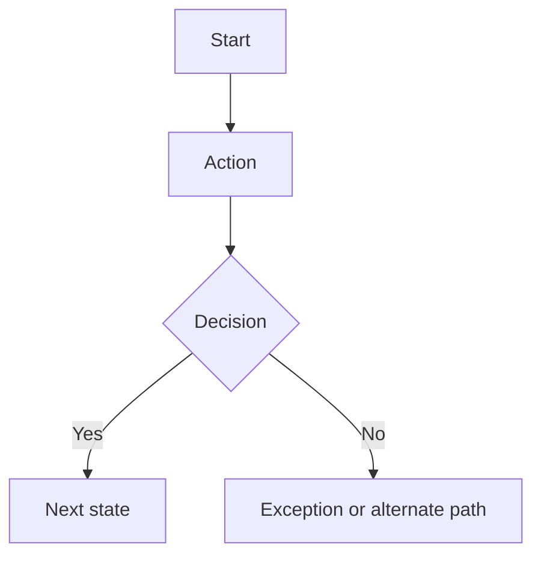

# Process Flows

## Metadata
- Generated at: `__GENERATED_AT_ISO__`
- Repository: `__DERIVE_FROM_REPO__`
- Revision: `__DETECT_CURRENT_REVISION__`
- Confidence: `__SET_BY_GENERATOR__`

## Purpose
Document important operational workflows with text explanations and Mermaid diagrams.

## Mermaid rules
- Use valid Mermaid syntax only.
- Prefer `flowchart TD` unless `LR` is clearer.
- Keep node labels concise.
- Split large flows into multiple diagrams.
- Do not invent branches.

## Flow template
### [Process name]
**Actors:**
- 

**Start condition:**

**Summary:**

**Notes:**
- 

## Flow evidence rules
Every process flow must be tied to real repository behavior. Use frontend routes, UI states, backend service transitions, database status fields, tests, changelog notes, and existing documentation as evidence.

For each flow, document:
- actor lanes or subgraphs when multiple roles participate
- start condition
- validation points
- state transitions
- success end state
- failure, retry, timeout, cancellation, rejection, or permission paths where evidence exists
- related feature IDs and document links

## Mermaid validation rules
- Keep node IDs simple and stable.
- Quote labels when they contain punctuation.
- Split large flows into smaller diagrams.
- Pair each Mermaid diagram with prose.
- If a branch is inferred, label it in prose, not as a verified fact.

## Repository-relative rule
Diagram notes and source references must use repository-relative paths only.
