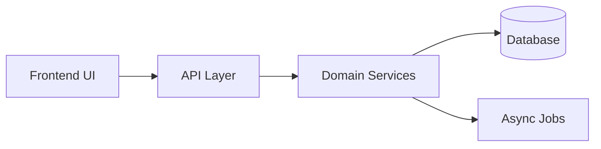

# Technical Architecture

## Metadata
- Generated at: `__GENERATED_AT_ISO__`
- Repository: `__DERIVE_FROM_REPO__`
- Revision: `__DETECT_CURRENT_REVISION__`
- Confidence: `__SET_BY_GENERATOR__`

## Purpose
Explain the technical structure of the system from repository to runtime behavior.

## Recommended sections
- Repository structure
- Frontend architecture
- Backend architecture
- API boundaries
- State management
- Auth and permission model
- Data/storage model
- Jobs and async behavior
- Integrations
- Validation and error handling

## Example Mermaid

## Architecture evidence rules
Architecture documentation must describe the real repository, not an idealized reference architecture.

Include:
- actual framework and runtime
- source layout
- module ownership
- dependency direction
- API and integration boundaries
- auth/session/permission enforcement points
- state management and cache ownership
- database access patterns
- background job and scheduler behavior
- observability, logging, errors, and retry clues
- deployment and environment signals when visible

## Required diagrams
Use Mermaid where useful for:
- high-level system context
- request lifecycle
- data flow
- auth flow
- background job flow
- integration/webhook flow

## Repository-relative rule
All implementation references must use repository-relative paths. Never include local workstation paths.
