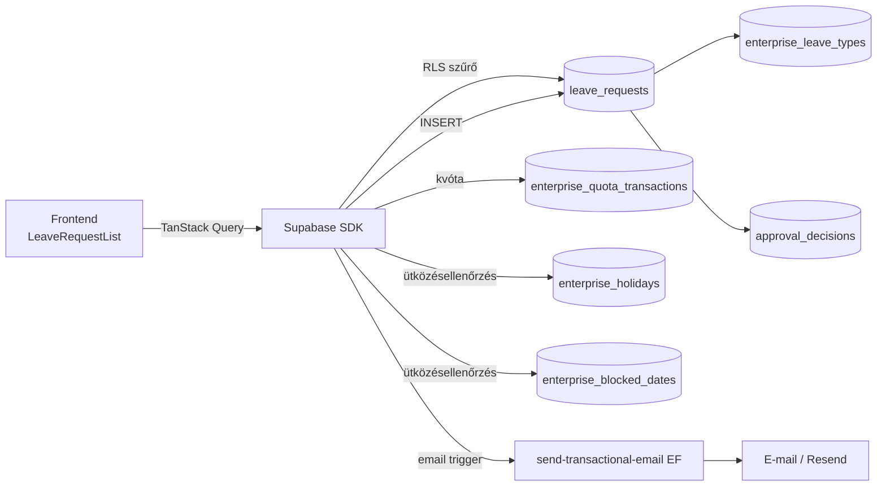
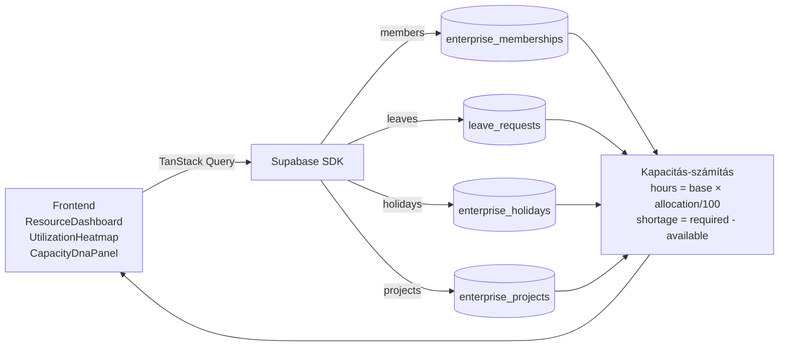

# Effectime Enterprise – Adat-folyam és entitás-referencia

<!-- METADATA -->
| Mező | Érték |
|---|---|
| Dokumentum | DATA_FLOW_AND_ENTITY_REFERENCE.md |
| Generálva | 2026-05-10T12:00:00Z |
| Repozitórium | HenrikFaul/effectime-app-enterprise-a95029a1 |
| Branch | claude/create-software-documentation-O7kj1 |
| Revision | 8919c402e74e41bbe83ccf1e6385c92d0fddeada |
| Megbízhatóság | Magas (verified: kódbázis-audit + táblanév szintű) |
| Kapcsolódó dok. | TECHNICAL_ARCHITECTURE.md, PROCESS_FLOWS.md, BUSINESS_SYSTEM_REFERENCE.md |

---

## Tartalomjegyzék

1. [ER diagram](#1-er-diagram)
2. [enterprise_workspaces](#2-enterprise_workspaces)
3. [enterprise_memberships](#3-enterprise_memberships)
4. [leave_requests](#4-leave_requests)
5. [approval_decisions](#5-approval_decisions)
6. [enterprise_leave_types](#6-enterprise_leave_types)
7. [enterprise_quota_transactions](#7-enterprise_quota_transactions)
8. [enterprise_holidays](#8-enterprise_holidays)
9. [enterprise_blocked_dates](#9-enterprise_blocked_dates)
10. [enterprise_approval_chains](#10-enterprise_approval_chains)
11. [enterprise_agile_issues](#11-enterprise_agile_issues)
12. [enterprise_projects](#12-enterprise_projects)
13. [enterprise_org_chart_snapshots](#13-enterprise_org_chart_snapshots)
14. [Kiegészítő táblák](#14-kiegészítő-táblák)
15. [Adat-folyam diagramok](#15-adat-folyam-diagramok)

---

## 1. ER diagram

```mermaid
flowchart TD
    WS[enterprise_workspaces\nid, name, timezone, locale\ncreated_by, is_archived\nrecovery_mode]
    
    MEM[enterprise_memberships\nuser_id, workspace_id, role\nstatus, team, location\nbusiness_role, city\noffice_id, base_working_hours]
    
    PRF[profiles\nid user_id\ndisplay_name, avatar_url]
    
    OFF[enterprise_offices\nid, workspace_id\nname, location]
    
    LR[leave_requests\nid, workspace_id, user_id\ntype_id, start_date, end_date\nstatus, is_half_day\nhalf_day_period, is_private\ncancellation_reason]
    
    AD[approval_decisions\nid, leave_request_id\nstep, approver_id\ndecision, decided_at, comment]
    
    LT[enterprise_leave_types\nid, workspace_id\nname, color\nmax_days, requires_approval]
    
    QT[enterprise_quota_transactions\nid, workspace_id, user_id\nleave_request_id, type_id\namount, balance_after\ntransaction_type, created_at]
    
    HOL[enterprise_holidays\nid, workspace_id\ndate, name, is_recurring]
    
    BLK[enterprise_blocked_dates\nid, workspace_id\ndate, reason]
    
    APC[enterprise_approval_chains\nid, workspace_id\nname, steps jsonb\nescalation_hours]
    
    AGI[enterprise_agile_issues\nid, workspace_id\nexternal_id, provider\ntitle, status, assignee\nsprint, story_points, synced_at]
    
    PRJ[enterprise_projects\nid, workspace_id\nname, start_date, end_date\nstatus, gantt_config jsonb]
    
    OCS[enterprise_org_chart_snapshots\nid, workspace_id\ncreated_at, snapshot_data jsonb]
    
    TRO[enterprise_translation_overrides\nid, workspace_id\nlocale, key, value]
    
    HLP[help_articles\nid, anchor_id\ntitle, content, updated_at]
    
    WS --> MEM
    WS --> LR
    WS --> LT
    WS --> QT
    WS --> HOL
    WS --> BLK
    WS --> APC
    WS --> AGI
    WS --> PRJ
    WS --> OCS
    WS --> TRO
    WS --> OFF
    
    MEM --> PRF
    MEM --> OFF
    
    LR --> LT
    LR --> AD
    LR --> QT
    
    style WS fill:#2196F3,color:#fff
    style LR fill:#FF9800,color:#fff
    style MEM fill:#4CAF50,color:#fff
```



---

## 2. enterprise_workspaces

### Leírás
A munkaterületek (szervezetek) alaptáblája. Minden adat workspace-szintű.

### Mezők

| Mező | Típus | Kötelező | Leírás |
|---|---|:---:|---|
| id | UUID | ✅ | Elsődleges kulcs |
| name | TEXT | ✅ | Munkaterület neve |
| timezone | TEXT | ✅ | Időzóna (pl. `Europe/Budapest`) |
| locale | TEXT | ✅ | Alapértelmezett nyelv (`HU` / `EN`) |
| created_by | UUID | ✅ | FK → auth.users (tulajdonos) |
| is_archived | BOOLEAN | ✅ | Archivált-e |
| recovery_mode | BOOLEAN | ✅ | Helyreállítási mód aktív-e |
| created_at | TIMESTAMPTZ | ✅ | Létrehozás ideje |

### Állapotok
- **Aktív**: `is_archived = false`, `recovery_mode = false` — normál működés
- **Archivált**: `is_archived = true` — rejtett, de adatok megmaradnak
- **Helyreállítási mód**: `recovery_mode = true` — olvasható, nem módosítható

### Kulcs szabályok
- Workspace törlése csak `owner` szerepkörrel lehetséges
- Demo workspace: `seed-demo-workspace` edge function hozza létre

---

## 3. enterprise_memberships

### Leírás
Felhasználó–munkaterület kapcsolótábla. Egy felhasználó több workspace-hez is tartozhat.

### Mezők

| Mező | Típus | Kötelező | Leírás |
|---|---|:---:|---|
| id | UUID | ✅ | Elsődleges kulcs |
| user_id | UUID | ✅ | FK → auth.users |
| workspace_id | UUID | ✅ | FK → enterprise_workspaces |
| role | TEXT | ✅ | `owner` / `resourceAssistant` / `member` |
| status | TEXT | ✅ | `active` / `invited` / `inactive` |
| team | TEXT | ❌ | Csapat neve |
| location | TEXT | ❌ | Helyszín / telephely |
| business_role | TEXT | ❌ | Munkakör azonosítója |
| city | TEXT | ❌ | Város |
| office_id | UUID | ❌ | FK → enterprise_offices |
| base_working_hours | NUMERIC | ❌ | Alap munkaidő (óra/nap) |
| created_at | TIMESTAMPTZ | ✅ | Hozzáadás ideje |

### Állapotok
- **invited**: meghívó kiküldve, de nem fogadta el
- **active**: aktív tag
- **inactive**: deaktivált tag

### Kapcsolódó entitások
- `profiles` (user_id) — megjelenítendő név, avatar
- `enterprise_offices` (office_id) — iroda / telephely

---

## 4. leave_requests

### Leírás
Szabadságkérelmek fő táblája. Minden kérelem workspace-szintű.

### Mezők

| Mező | Típus | Kötelező | Leírás |
|---|---|:---:|---|
| id | UUID | ✅ | Elsődleges kulcs |
| workspace_id | UUID | ✅ | FK → enterprise_workspaces |
| user_id | UUID | ✅ | FK → auth.users (kérelmező) |
| type_id | UUID | ✅ | FK → enterprise_leave_types |
| start_date | DATE | ✅ | Kezdő dátum |
| end_date | DATE | ✅ | Befejező dátum |
| status | TEXT | ✅ | `pending` / `approved` / `rejected` / `cancelled` |
| is_half_day | BOOLEAN | ✅ | Félnapos kérelem |
| half_day_period | TEXT | ❌ | `morning` / `afternoon` (ha is_half_day=true) |
| is_private | BOOLEAN | ✅ | Privát kérelem (mások nem látják a részleteket) |
| cancellation_reason | TEXT | ❌ | Visszavonás oka |
| created_at | TIMESTAMPTZ | ✅ | Beküldés ideje |

### Állapotgép

```
[SUBMIT]
  │
  ▼
pending ──[APPROVE]──► approved ──[CANCEL by submitter]──► cancelled
  │                       │
  ├──[REJECT]──► rejected │
  │                       │
  └──[CANCEL by submitter]┘
```

### Kulcs szabályok
- Kétlépéses beküldés: Check → Submit
- Blokkoló ütközések: ünnepnap, tiltott nap, saját párhuzamos pending kérelem
- Figyelmeztetések: max_absent, kolléga átfedés
- Jóváhagyáskor kvóta csökkentése (`enterprise_quota_transactions`)

---

## 5. approval_decisions

### Leírás
Jóváhagyási döntések táblája — minden lánc-lépés döntését rögzíti.

### Mezők

| Mező | Típus | Kötelező | Leírás |
|---|---|:---:|---|
| id | UUID | ✅ | Elsődleges kulcs |
| leave_request_id | UUID | ✅ | FK → leave_requests |
| step | INTEGER | ✅ | Lánc-lépés sorszáma (1-től) |
| approver_id | UUID | ✅ | FK → auth.users (döntéshozó) |
| decision | TEXT | ✅ | `approved` / `rejected` / `escalated` |
| decided_at | TIMESTAMPTZ | ✅ | Döntés ideje |
| comment | TEXT | ❌ | Megjegyzés a döntéshez |

---

## 6. enterprise_leave_types

### Leírás
Szabadságtípusok katalógusa workspace-szinten (pl. éves szabadság, betegszabadság).

### Mezők

| Mező | Típus | Kötelező | Leírás |
|---|---|:---:|---|
| id | UUID | ✅ | Elsődleges kulcs |
| workspace_id | UUID | ✅ | FK → enterprise_workspaces |
| name | TEXT | ✅ | Típus neve |
| color | TEXT | ❌ | Szín (hex) megjelenítéshez |
| max_days | INTEGER | ❌ | Maximális napok száma évente (null = korlátlan) |
| requires_approval | BOOLEAN | ✅ | Kötelező jóváhagyás |
| created_at | TIMESTAMPTZ | ✅ | Létrehozás ideje |

---

## 7. enterprise_quota_transactions

### Leírás
Szabadság-egyenleg főkönyv. Minden változást tranzakcióként rögzít.

### Mezők

| Mező | Típus | Kötelező | Leírás |
|---|---|:---:|---|
| id | UUID | ✅ | Elsődleges kulcs |
| workspace_id | UUID | ✅ | FK → enterprise_workspaces |
| user_id | UUID | ✅ | FK → auth.users |
| leave_request_id | UUID | ❌ | FK → leave_requests (ha kérelemhez kötött) |
| type_id | UUID | ✅ | FK → enterprise_leave_types |
| amount | NUMERIC | ✅ | Változás napokban (negatív = felhasználás) |
| balance_after | NUMERIC | ✅ | Egyenleg a tranzakció után |
| transaction_type | TEXT | ✅ | `allocation` / `usage` / `reversal` / `adjustment` |
| created_at | TIMESTAMPTZ | ✅ | Tranzakció ideje |

### Tranzakció típusok
- `allocation`: éves keretbiztosítás (pl. év eleji feltöltés)
- `usage`: kérelem jóváhagyásakor levonás
- `reversal`: kérelem visszavonásakor visszaírás
- `adjustment`: admin kézi korrekció

---

## 8. enterprise_holidays

### Leírás
Munkaterület-specifikus ünnepnapok.

### Mezők

| Mező | Típus | Kötelező | Leírás |
|---|---|:---:|---|
| id | UUID | ✅ | Elsődleges kulcs |
| workspace_id | UUID | ✅ | FK → enterprise_workspaces |
| date | DATE | ✅ | Az ünnepnap dátuma |
| name | TEXT | ✅ | Az ünnepnap neve |
| is_recurring | BOOLEAN | ✅ | Évente ismétlődő-e |
| created_at | TIMESTAMPTZ | ✅ | Létrehozás ideje |

### Kapcsolódó szabályok
- Ünnepnapra eső szabadságkérelem blokkoló ütközést okoz
- `sync-holidays` edge function: külső API-ból szinkronizálja

---

## 9. enterprise_blocked_dates

### Leírás
Admin által letiltott dátumok (pl. céges esemény, audit időszak).

### Mezők

| Mező | Típus | Kötelező | Leírás |
|---|---|:---:|---|
| id | UUID | ✅ | Elsődleges kulcs |
| workspace_id | UUID | ✅ | FK → enterprise_workspaces |
| date | DATE | ✅ | Tiltott dátum |
| reason | TEXT | ❌ | Indoklás |
| created_at | TIMESTAMPTZ | ✅ | Létrehozás ideje |

### Kapcsolódó szabályok
- Tiltott napra eső kérelem blokkoló ütközést okoz (nem beküldhetők)

---

## 10. enterprise_approval_chains

### Leírás
Jóváhagyási lánc konfigurációk. Minden lánc tartalmaz rendezett lépéseket.

### Mezők

| Mező | Típus | Kötelező | Leírás |
|---|---|:---:|---|
| id | UUID | ✅ | Elsődleges kulcs |
| workspace_id | UUID | ✅ | FK → enterprise_workspaces |
| name | TEXT | ✅ | Lánc neve |
| steps | JSONB | ✅ | Rendezett jóváhagyó lépések listája |
| escalation_hours | INTEGER | ❌ | Eszkalációs időküszöb (óra) |
| created_at | TIMESTAMPTZ | ✅ | Létrehozás ideje |

### `steps` JSONB struktúra (inferred)
```json
[
  {
    "step": 1,
    "approver_type": "user" | "role",
    "approver_id": "<user_id or role>",
    "escalate_to": "<user_id>"
  }
]
```

---

## 11. enterprise_agile_issues

### Leírás
Jira / Azure DevOps issue-k helyi cache táblája.

### Mezők

| Mező | Típus | Kötelező | Leírás |
|---|---|:---:|---|
| id | UUID | ✅ | Elsődleges kulcs |
| workspace_id | UUID | ✅ | FK → enterprise_workspaces |
| external_id | TEXT | ✅ | Külső rendszer azonosítója (Jira key / ADO ID) |
| provider | TEXT | ✅ | `jira` / `ado` |
| title | TEXT | ✅ | Issue cím |
| status | TEXT | ❌ | Issue státusz |
| assignee | TEXT | ❌ | Hozzárendelt személy |
| sprint | TEXT | ❌ | Sprint neve / azonosítója |
| story_points | NUMERIC | ❌ | Story point értéke |
| synced_at | TIMESTAMPTZ | ✅ | Utolsó szinkronizáció ideje |

---

## 12. enterprise_projects

### Leírás
Projektek a Gantt-tervező és kapacitáskezelés számára.

### Mezők

| Mező | Típus | Kötelező | Leírás |
|---|---|:---:|---|
| id | UUID | ✅ | Elsődleges kulcs |
| workspace_id | UUID | ✅ | FK → enterprise_workspaces |
| name | TEXT | ✅ | Projekt neve |
| start_date | DATE | ❌ | Projekt kezdési dátuma |
| end_date | DATE | ❌ | Projekt befejezési dátuma |
| status | TEXT | ❌ | Projekt státusz (`active`, `completed`, stb.) |
| gantt_config | JSONB | ❌ | Gantt megjelenítési konfiguráció |
| created_at | TIMESTAMPTZ | ✅ | Létrehozás ideje |

---

## 13. enterprise_org_chart_snapshots

### Leírás
Szervezeti ábra pillanatfelvételek jövőbeli összehasonlításhoz.

### Mezők

| Mező | Típus | Kötelező | Leírás |
|---|---|:---:|---|
| id | UUID | ✅ | Elsődleges kulcs |
| workspace_id | UUID | ✅ | FK → enterprise_workspaces |
| created_at | TIMESTAMPTZ | ✅ | Pillanatfelvétel ideje |
| snapshot_data | JSONB | ✅ | Szervezeti fa teljes állapota |

---

## 14. Kiegészítő táblák

### enterprise_offices
| Mező | Típus | Leírás |
|---|---|---|
| id | UUID | Elsődleges kulcs |
| workspace_id | UUID | FK → enterprise_workspaces |
| name | TEXT | Iroda neve |
| location | TEXT | Fizikai helyszín |

### enterprise_translation_overrides
| Mező | Típus | Leírás |
|---|---|---|
| id | UUID | Elsődleges kulcs |
| workspace_id | UUID | FK → enterprise_workspaces |
| locale | TEXT | `HU` / `EN` |
| key | TEXT | Fordítási kulcs |
| value | TEXT | Egyéni fordítás |

### help_articles
| Mező | Típus | Leírás |
|---|---|---|
| id | UUID | Elsődleges kulcs |
| anchor_id | TEXT | Help anchor azonosító (pl. `workspace.calendar`) |
| title | TEXT | Cikk címe |
| content | TEXT | Cikk tartalma (Markdown) |
| updated_at | TIMESTAMPTZ | Utolsó frissítés |

**Hozzáférés**: publikus olvasás, csak service_role írhat.

### profiles
| Mező | Típus | Leírás |
|---|---|---|
| id | UUID | FK → auth.users |
| display_name | TEXT | Megjelenített név |
| avatar_url | TEXT | Avatar URL |

---

## 15. Adat-folyam diagramok

### Szabadságkérelem adatfolyam



### Kapacitásszámítás adatfolyam


