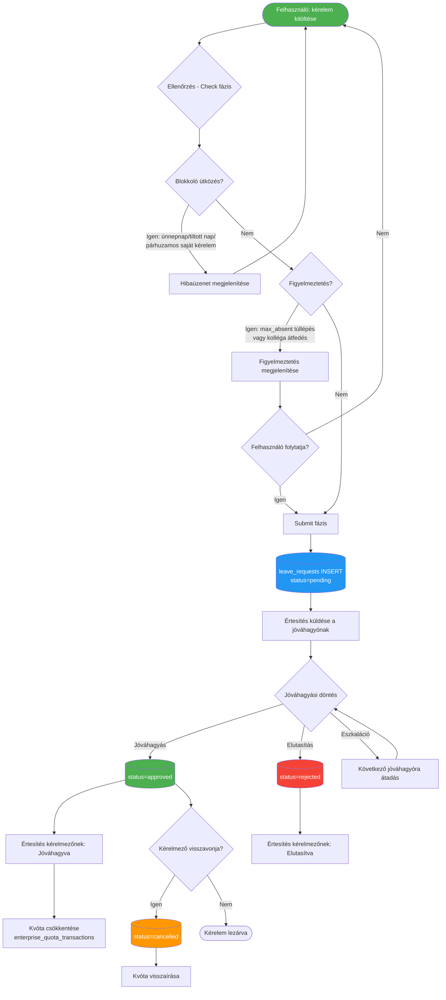
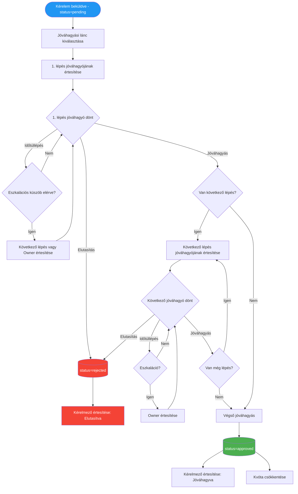
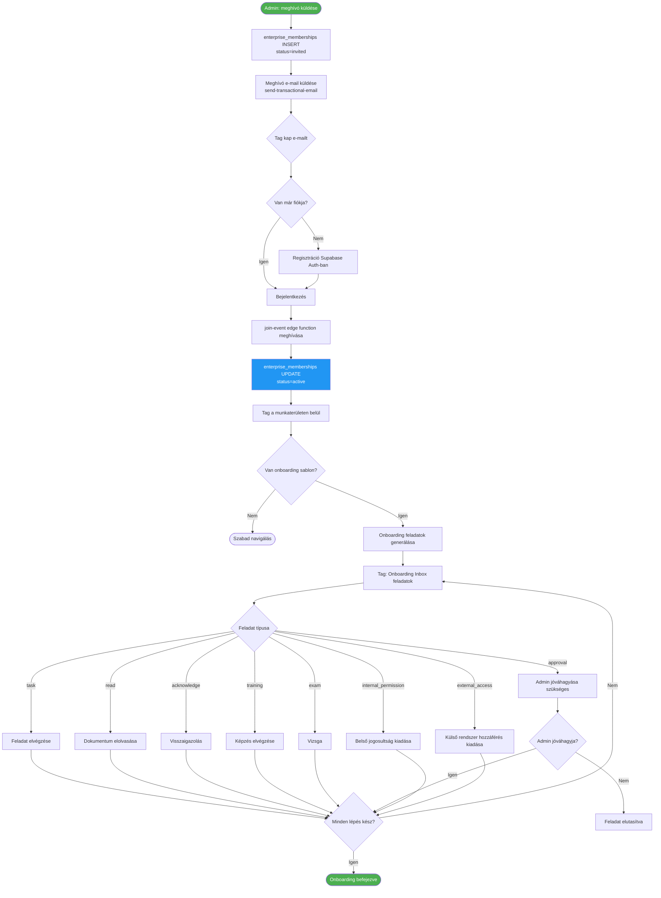
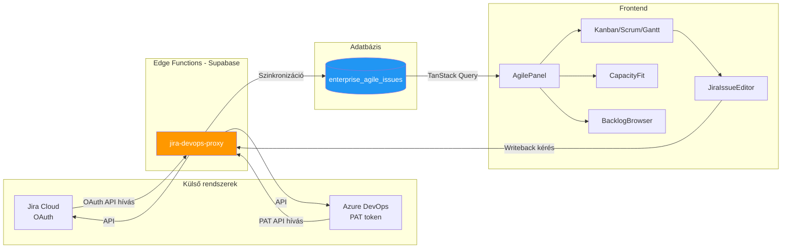
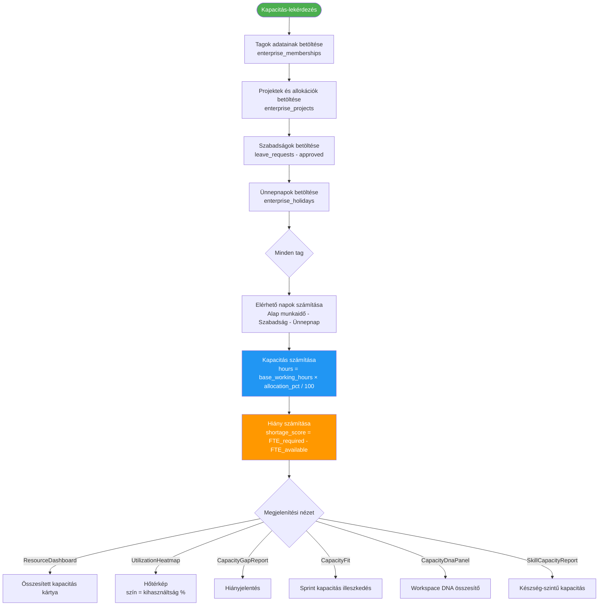
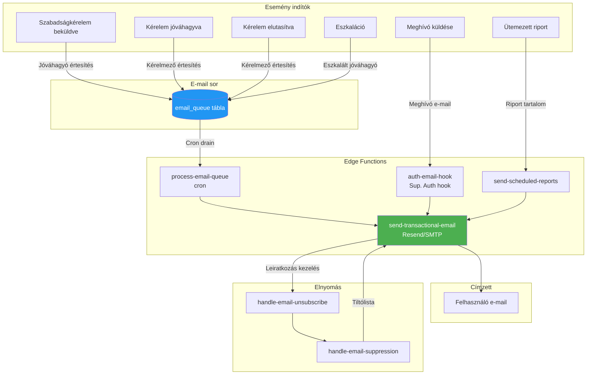

# Effectime Enterprise – Folyamatábrák

<!-- METADATA -->
| Mező | Érték |
|---|---|
| Dokumentum | PROCESS_FLOWS.md |
| Generálva | 2026-05-10T12:00:00Z |
| Repozitórium | HenrikFaul/effectime-app-enterprise-a95029a1 |
| Branch | claude/create-software-documentation-O7kj1 |
| Revision | 8919c402e74e41bbe83ccf1e6385c92d0fddeada |
| Megbízhatóság | Magas (verified szabályok alapján) |
| Kapcsolódó dok. | BUSINESS_SYSTEM_REFERENCE.md, DATA_FLOW_AND_ENTITY_REFERENCE.md |

---

## Tartalomjegyzék

1. [Szabadságkérelem beküldése és jóváhagyási életciklus](#1-szabadságkérelem-beküldése-és-jóváhagyási-életciklus)
2. [Többlépéses jóváhagyási lánc](#2-többlépéses-jóváhagyási-lánc)
3. [Tag meghívása és onboarding folyamat](#3-tag-meghívása-és-onboarding-folyamat)
4. [Agile szinkronizáció (Jira/ADO)](#4-agile-szinkronizáció-jiraado)
5. [Kapacitásszámítás folyamata](#5-kapacitásszámítás-folyamata)
6. [E-mail értesítési folyamat](#6-e-mail-értesítési-folyamat)

---

## 1. Szabadságkérelem beküldése és jóváhagyási életciklus

---

## 2. Többlépéses jóváhagyási lánc

---

## 3. Tag meghívása és onboarding folyamat

---

## 4. Agile szinkronizáció (Jira/ADO)

---

## 5. Kapacitásszámítás folyamata

---

## 6. E-mail értesítési folyamat

