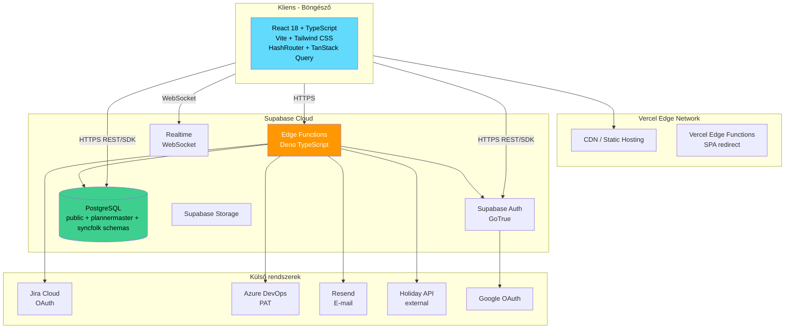

# Effectime Enterprise – Technikai architektúra

<!-- METADATA -->
| Mező | Érték |
|---|---|
| Dokumentum | TECHNICAL_ARCHITECTURE.md |
| Generálva | 2026-05-10T12:00:00Z |
| Repozitórium | HenrikFaul/effectime-app-enterprise-a95029a1 |
| Branch | claude/create-software-documentation-O7kj1 |
| Revision | 8919c402e74e41bbe83ccf1e6385c92d0fddeada |
| Megbízhatóság | Magas |
| Kapcsolódó dok. | DATA_FLOW_AND_ENTITY_REFERENCE.md, CHANGE_INTELLIGENCE_APPENDIX.md, PROCESS_FLOWS.md |

---

## Tartalomjegyzék

1. [Rendszer architektúra áttekintés](#1-rendszer-architektúra-áttekintés)
2. [Repozitórium struktúra](#2-repozitórium-struktúra)
3. [Frontend architektúra](#3-frontend-architektúra)
4. [Backend architektúra (Supabase)](#4-backend-architektúra-supabase)
5. [Adatbázis séma](#5-adatbázis-séma)
6. [Auth rendszer](#6-auth-rendszer)
7. [Edge Function API-k](#7-edge-function-api-k)
8. [Integrációk](#8-integrációk)
9. [Deployment](#9-deployment)

---

## 1. Rendszer architektúra áttekintés



---

## 2. Repozitórium struktúra

```
effectime-app-enterprise-a95029a1/
├── src/                         # Frontend forráskód
│   ├── components/              # Újrafelhasználható UI komponensek
│   ├── pages/                   # Oldalszintű komponensek (route-onként)
│   ├── hooks/                   # Custom React hookok
│   ├── lib/                     # Utility könyvtárak, Supabase kliens
│   ├── types/                   # TypeScript típusdefiníciók
│   └── contexts/                # React Context providerek
├── supabase/
│   ├── functions/               # Edge Functions (Deno TypeScript)
│   └── migrations/              # SQL migrációk
├── public/                      # Statikus fájlok
├── docs/                        # Dokumentáció (ez a mappa)
│   ├── help/                    # Help rendszer fájlok
│   └── manual/                  # Kézikönyv anyagok
├── versioning/                  # PR/verzió leíró fájlok
├── index.html                   # SPA belépési pont
├── vite.config.ts               # Vite konfiguráció
├── tailwind.config.ts           # Tailwind CSS konfiguráció
├── tsconfig.json                # TypeScript konfiguráció
├── vercel.json                  # Vercel deployment konfiguráció
├── CHANGELOG.md                 # Változásnapló
├── CLAUDE.md                    # AI session instrukciók
└── package.json                 # Függőségek
```

---

## 3. Frontend architektúra

### Technológiai stack
| Technológia | Verzió | Szerepkör |
|---|---|---|
| React | 18.x | UI framework |
| TypeScript | 5.x | Típusbiztos JavaScript |
| Vite | 5.x | Build tool, dev server |
| Tailwind CSS | 3.x | Utility-first CSS |
| shadcn/ui | Latest | Komponens könyvtár (Radix UI alapú) |
| TanStack Query | v5 | Szerver-állapot kezelés, caching |
| React Router (HashRouter) | 6.x | Kliens-oldali routing |
| Lucide Icons | Latest | Ikon készlet |
| @tanstack/react-virtual | Latest | Lista virtualizáció (TimelineView) |

### Routing architektúra
- `HashRouter` — hash-alapú routing, Vercel SPA-kompatibilis
- `HashRouteBridge` — bridge komponens, hash route kezeléshez
- `SpaRedirectHandler` — kezeli a Vercel SPA redirect eseteit
- `ProtectedRoute` — védett route wrapper (auth ellenőrzés)
- `PublicRoute` — publikus route wrapper (átirányítás ha be van lépve)

### Állapotkezelés
- **Szerver állapot**: TanStack Query v5 — automatikus caching, invalidáció, optimistic updates
- **Auth állapot**: Supabase Auth session, React Context
- **UI állapot**: React useState / useReducer (lokális)
- **Globális UI**: `UiSectionStateManager` (sections collapse state)

### I18n rendszer
- `I18nProvider` — custom React Context provider
- Locale-ok: `HU` (alapértelmezett), `EN`
- Workspace-szintű CSV override-ok: `enterprise_translation_overrides` tábla
- `LocalizationSettings` UI komponens a fordítások kezeléséhez

### Help rendszer
- `HelpRegistryProvider` — anchor ID-k regisztrálása
- `HelpDrawer` — oldalsáv segítség megjelenítő
- `help_articles` tábla — tartalomtár
- `help-regenerator` edge function — újragenerálás `help-reference.md`-ből
- `HelpSystemSettings` — admin UI a help konfiguráláshoz

### Kulcs React Contextek / Providerek
| Provider | Szerepkör |
|---|---|
| AuthProvider | Supabase session, user |
| WorkspaceProvider | Aktív workspace, members |
| PermissionsProvider | `canView()`, `canEdit()` permission API |
| I18nProvider | Fordítások |
| HelpRegistryProvider | Help anchor regisztráció |

---

## 4. Backend architektúra (Supabase)

### Supabase szolgáltatások
| Szolgáltatás | Technológia | Szerepkör |
|---|---|---|
| Auth | GoTrue | Felhasználói autentikáció |
| PostgreSQL | Postgres 15+ | Elsődleges adatbázis |
| Edge Functions | Deno TypeScript | Szerver-oldali logika |
| Storage | S3-compatible | Fájlok (pl. avatar, import) |
| Realtime | WebSocket/pglogical | Valós idejű adatfrissítés (inferred) |

### Row Level Security (RLS)
Minden enterprise_ tábla RLS-sel védett. Általános minták:
- A felhasználó csak a saját workspace-éhez tartozó sorokat látja
- Service role bypass: edge functions service_role kulccsal hívnak
- `help_articles`: publikus olvasás, service_role írás

### pg_cron ütemezett feladatok
- **02:15 UTC**: lefedettségi szabályok automatikus archiválása
- Egyéb cron: `send-scheduled-reports`, `process-email-queue` (inferred)
- A v3.51.8 created-identity cleanup ötperces schedulere alapértelmezetten
  **nincs telepítve**. Az owner-only installer csak restored-staging acceptance
  után hívható: a project origint, legacy anon JWT-t és külön trigger secretet
  Vaultból oldja fel minden futáskor, az URL-t és credentialt nem tárolja a
  `cron.job.command` mezőben. A rollout sorrend DB → érintett Edge funkciók →
  scheduler-last; részletek: `docs/runbooks/created-identity-cleanup.md`.

### Edge Functions áttekintés

| Funkció neve | Runtime | Szerepkör |
|---|---|---|
| `seed-demo-workspace` | Deno | Demo workspace létrehozás (22 persona, 38+ kérelem) |
| `join-event` | Deno | Meghívó elfogadás kezelése |
| `leave-ical` | Deno | iCal feed jóváhagyott szabadságokhoz |
| `jira-devops-proxy` | Deno | Jira + Azure DevOps API proxy |
| `run-report` | Deno | Mentett riport futtatás |
| `send-transactional-email` | Deno | Tranzakciós e-mailek (Resend/SMTP) |
| `process-email-queue` | Deno | E-mail sor leürítés (cron) |
| `help-regenerator` | Deno | help_articles regenerálás |
| `send-scheduled-reports` | Deno | Ütemezett riport küldés |
| `sync-holidays` | Deno | Ünnepnap szinkronizáció (külső API) |
| `cleanup-demo-workspace` | Deno | Lejárt demo workspace törlés |
| `cleanup-temp-users` | Deno | Legacy ideiglenes profilok service-role-only cleanupja; created-identity sagát nem futtat |
| `cleanup-created-identities` | Deno | Tokenesen fence-elt, singleton created-identity kompenzációs worker |
| `create-instant-enterprise-member` | Deno | Azonnali tag létrehozás meghívó nélkül |
| `auth-email-hook` | Deno | Supabase auth e-mail testreszabás |
| `delete-account` | Deno | Önkiszolgáló fiók törlés |
| `admin` | Deno | Platform admin API |
| `preview-transactional-email` | Deno | Dev e-mail sablon előnézet |
| `handle-email-suppression` | Deno | E-mail tiltólista kezelés |
| `handle-email-unsubscribe` | Deno | Leiratkozás kezelő |

---

## 5. Adatbázis séma

### Sémák

| Séma | Szerepkör |
|---|---|
| `public` | Fő séma (minden enterprise_ tábla, profiles, auth objektumok) |
| `plannermaster` | Enterprise séma klón (additív, jövőbeli multi-product szétválasztáshoz) |
| `syncfolk` | Consumer app séma klón |

### Kulcs táblák (public séma)

```
enterprise_workspaces
  └── enterprise_memberships (workspace_id FK)
        ├── enterprise_offices (office_id FK)
        └── profiles (user_id FK)

leave_requests (workspace_id, user_id FKs)
  ├── approval_decisions (leave_request_id FK)
  ├── enterprise_leave_types (type_id FK)
  └── enterprise_quota_transactions

enterprise_approval_chains (workspace_id FK)

enterprise_holidays (workspace_id FK)
enterprise_blocked_dates (workspace_id FK)
enterprise_daily_rules (workspace_id FK)

enterprise_projects (workspace_id FK)
enterprise_agile_issues (workspace_id FK)
enterprise_org_chart_snapshots (workspace_id FK)
enterprise_translation_overrides (workspace_id FK)

help_articles
```

Részletes leírás: [DATA_FLOW_AND_ENTITY_REFERENCE.md](docs/DATA_FLOW_AND_ENTITY_REFERENCE.md)

---

## 6. Auth rendszer

### Módszerek
| Módszer | Implementáció |
|---|---|
| E-mail + jelszó | Supabase Auth natív |
| Google OAuth | Supabase Auth Google provider |
| Magic Link | Supabase Auth magic link |

### Folyamat
1. Felhasználó bejelentkezik (Supabase Auth / GoTrue)
2. JWT token kiadása (access + refresh token)
3. A Supabase kliens automatikusan kezeli a token refresh-t
4. RLS policy-k a JWT `sub` (user_id) alapján szűrnek
5. `auth-email-hook` edge function testreszabja az auth e-maileket

### Route védelem
- `ProtectedRoute`: auth session ellenőrzés, átirányítás `/#/auth`-ra
- `PublicRoute`: ha be van lépve, átirányítás `/#/app`-ra

### Fiók törlés
- `delete-account` edge function: önkiszolgáló törlés
- Supabase Auth user + kapcsolódó adatok törlése

---

## 7. Edge Function API-k

### Általános hívási minta
```
POST https://<project>.supabase.co/functions/v1/<function-name>
Authorization: Bearer <jwt-token>
Content-Type: application/json

{ "body": "..." }
```

### Kulcs endpoint-ok

#### `seed-demo-workspace`
```
POST /functions/v1/seed-demo-workspace
Body: { "workspace_id": string }
Returns: { "success": boolean, "error"?: string }
```

#### `join-event`
```
POST /functions/v1/join-event
Body: { "invite_token": string }
Returns: { "workspace_id": string }
```

#### `leave-ical`
```
GET /functions/v1/leave-ical?workspace_id=<id>&token=<token>
Returns: iCal text/calendar
```

#### `jira-devops-proxy`
```
POST /functions/v1/jira-devops-proxy
Body: { "provider": "jira"|"ado", "endpoint": string, "method": string, "data"?: object }
Returns: provider API response
```

#### `run-report`
```
POST /functions/v1/run-report
Body: { "report_id": string, "params": object }
Returns: { "rows": array, "columns": array }
```

#### `send-transactional-email`
```
POST /functions/v1/send-transactional-email
Body: { "template": string, "to": string, "data": object }
Returns: { "success": boolean }
```

#### `help-regenerator`
```
POST /functions/v1/help-regenerator
Body: {}
Returns: { "regenerated": number }
```

---

## 8. Integrációk

### Jira (OAuth)
- OAuth 2.0 flow a Jira Cloud-dal
- Issue szinkronizáció: `enterprise_agile_issues` tábla
- Writeback: változások visszaírása Jira-ba
- Proxy: `jira-devops-proxy` edge function
- Config: Settings → Integrations → Jira

### Azure DevOps (PAT token)
- Personal Access Token autentikáció
- Issue szinkronizáció: `enterprise_agile_issues` tábla
- Writeback: változások visszaírása ADO-ba
- Proxy: `jira-devops-proxy` edge function
- Config: Settings → Integrations → Azure DevOps

### iCal feed
- Végpont: `leave-ical` edge function
- Hitelesítés: token-alapú (workspace-specific)
- Tartalom: jóváhagyott szabadságok
- Fogyasztók: Outlook, Google Calendar, Apple Calendar
- Config: Settings → iCal

### E-mail (Resend/SMTP)
- Szállítás: `send-transactional-email` edge function
- Provider: Resend (inferred) vagy SMTP
- Sor-alapú: `process-email-queue` (cron drain)
- Tiltólista: `handle-email-suppression`
- Leiratkozás: `handle-email-unsubscribe` + `/#/unsubscribe`

### Ünnepnap API
- `sync-holidays` edge function
- Külső ünnepnap adatforrás szinkronizálása
- Config: Settings → Holidays → Szinkronizálás

---

## 9. Deployment

### Frontend (provider-managed CDN)
- Build tool: Vite → statikus fájlok
- A repository Vercel-kompatibilis konfigurációt tartalmaz, de a jelenlegi live
  provider és immutable deployment-ID nincs hiteles release evidence-hez kötve.
- SPA konfiguráció: `vercel.json`, `public/_redirects` és provider-specifikus
  fallback (összes alkalmazásroute → `index.html`).
- Környezeti változók: Supabase URL, Supabase Anon Key, stb.

### Backend (Supabase Cloud)
- Adatbázis: Supabase managed PostgreSQL
- Edge Functions: Supabase managed Deno runtime
- Auth: Supabase GoTrue (managed)
- Migrációk: `supabase/migrations/` mappa, `supabase db push` paranccsal

### Migrációk kezelése
```
supabase/migrations/
  └── <timestamp>_<description>.sql
```
- Mindig előre, soha visszafele (no rollback)
- Schema drift risk: lásd `CHANGE_INTELLIGENCE_APPENDIX.md`

### Környezetek
| Környezet | Frontend | Backend |
|---|---|---|
| Production | Provider-managed CDN; pontos artifact/deployment ID auditálandó | Supabase production project |
| Development | `localhost:5173` (Vite dev server) | Supabase cloud vagy local |

### Lokális fejlesztés
```bash
# Frontend
npm ci
npm run dev

# Supabase Edge Functions lokálisan (inferred)
supabase functions serve
```
