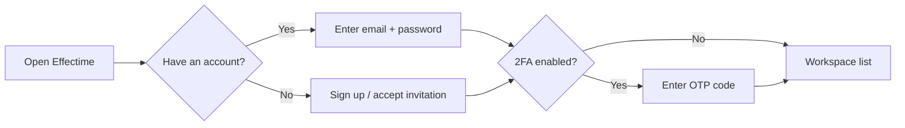

# Getting Started with Effectime

> **Summary**: Effectime is an enterprise workforce management platform. This guide helps you sign in, navigate your workspace, and find the key features you need day to day.

---

## Where to find it

After signing in at `https://effectime.app`, you land on the workspace selector — the home screen that lists every workspace you belong to.

---

## What it does

Effectime organises your team into **workspaces**. Each workspace is a self-contained organisation with its own:
- Members and roles
- Leave policies, holidays, and quota rules
- Approval chains and notification settings
- Projects, integrations, and reports

You can belong to multiple workspaces at once (e.g. one per company or department).

---

## How to sign in

1. Go to the Effectime login page.
2. Enter your **email** and **password**, or click **Sign in with Google**.
3. If you have two-factor configured, complete the OTP step.
4. You land on the workspace list.



---

## The workspace list

| Element | Description |
|---|---|
| Workspace card | Click to enter that workspace |
| **New workspace** | Create a fresh workspace (you become the Owner) |
| Language flag (top-right) | Switch UI language between English and Hungarian |
| Profile menu | Sign out, view profile, access settings |

---

## First steps inside a workspace

1. **Members tab** — see who is in the workspace; invite new people.
2. **Calendar tab** — view leave, submit time-off requests, check the coverage planner.
3. **Requests tab** — track your own leave requests.
4. **Workflows tab** — onboarding templates and access requests.
5. **Resources tab** — projects, capacity, agile boards.
6. **Reports tab** — KPI dashboard, audit log, CSV export.
7. **Settings tab** — workspace configuration (admin only for most settings).

---

## The Help system

Click the **?** button on the left side of any workspace header to open context-aware help for the current page.

You can also **drag** the ? icon onto any section of the page to see help specifically for that area.

---

## Metadata

```
version: 3.2.2
locale: en
topic_id: getting-started
generated_by: curated-v1
```
