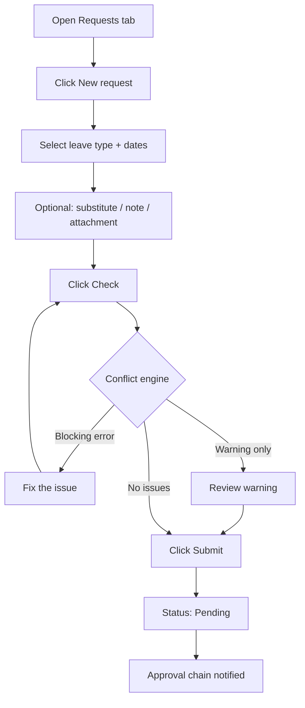
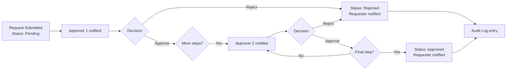

# Leave Requests and Approval Flow

> **Summary**: How to submit time-off requests, navigate the two-step conflict check, and how approvals travel through the configured chain.

---

## Leave Request — Submitting

### Where to find it
**Workspace → Requests tab** → **New request** button.

### What it does
The leave request form records any planned absence. Types are configured by your admin (vacation, sick leave, unpaid leave, custom types). Once submitted, the request enters the approval chain.

### How to submit a request — step by step

1. Open your workspace and click the **Requests** tab.
2. Click **New request**.
3. Choose a **leave type** from the dropdown.
4. Set **start date** and **end date**.
5. Optionally: add a **note**, assign a **substitute**, and attach a supporting file.
6. Click **Check** — the conflict engine validates your dates:
   - **Blocking errors** (red): must be resolved before submitting (e.g. blocked date, holiday overlap).
   - **Warnings** (amber): informational; you can still submit.
7. Click **Submit**. Status becomes **Pending**.



### Common actions
| Action | Where |
|---|---|
| **New request** | Requests tab header |
| **Cancel request** | Three-dot menu on any Pending request |
| **Private toggle** | Hides the note from approvers |
| **Substitute picker** | Select a colleague to cover your absence |
| **Attach file** | Upload supporting document (stored in Supabase Storage) |

### Leave types
Leave types are defined per workspace. Common defaults: Vacation, Sick Leave, Unpaid Leave. Admins add or archive types in **Settings → Leave Types**.

---

## Approval Flow

### Where to find it
**Workspace → Approvals tab** (visible to approvers) and **Settings → Approval Chains** (admin configuration).

### What it does
The approval chain defines an ordered list of approvers. After a request is submitted, each approver in the chain receives a notification. The final approver's decision is binding.

### How approvals work — step by step

1. Member submits a request → status: **Pending**.
2. First approver in the chain receives an **in-app notification** and email.
3. Approver opens **Approvals tab → Approval Inbox**.
4. Approver reviews the request and clicks **Approve** or **Reject**.
5. If there is a next step in the chain, the next approver is notified.
6. Final approver's decision closes the chain → status: **Approved** or **Rejected**.
7. The original requester receives a notification.
8. The decision is written to the immutable **Audit Log**.



### Escalation
If an approver does not act within the configured threshold (hours), the request is automatically escalated to the next step or to the workspace owner.

### Bulk decisions
In the Approvals tab, check multiple requests and click **Approve all** or **Reject all** to process them in one action.

---

## Troubleshooting

| Problem | Solution |
|---|---|
| "Blocked date" error | The chosen date overlaps a workspace-blocked date. Check **Settings → Blocked Dates**. |
| "Holiday" error | The date is a public holiday. Check **Settings → Holiday Manager**. |
| "Max absent" warning | Too many teammates are already on leave those days. You can still submit; the approver decides. |
| Request stuck in Pending | Check if all approvers in the chain have been notified. Contact the workspace owner if escalation hasn't triggered. |
| Can't see the Approvals tab | Only Owners and Resource Assistants see the full Approval Inbox by default. Check your role or contact your admin. |

---

## Related
- Quota Manager
- Holiday Manager
- Audit Log
- Notifications

---

## Metadata

```
version: 3.2.2
locale: en
topic_id: leave-requests-and-approvals
generated_by: curated-v1
```
