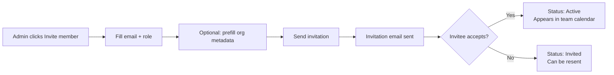
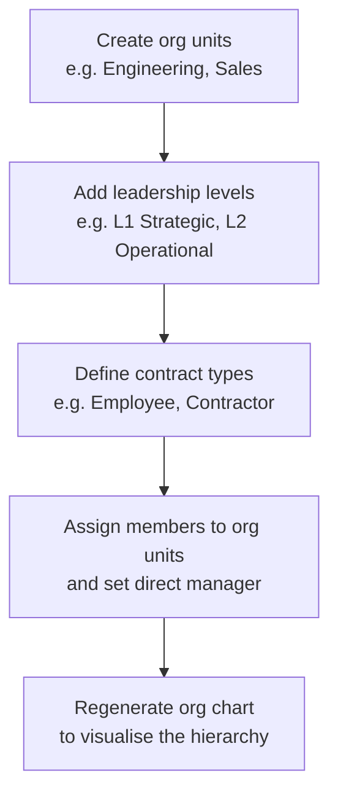

# Members and Organization

> **Summary**: Manage who is in your workspace, their roles and positions, and the full organizational hierarchy including the auto-generated org chart.

---

## Members Tab

### Where to find it
**Workspace → Members tab** (first tab).

### What it does
The Members tab is the people directory. From here you can:
- Invite new members
- View and edit roles, positions, teams, and skills
- Open detailed member profile sheets
- Manage leave allowances and quota balances

### How to invite a member

1. Click **Invite member**.
2. Enter the person's **email address**.
3. Assign a **role**: Owner, Resource Assistant, or Member.
4. Optionally prefill: team, office location, position, direct manager, org unit, contract type, leadership level.
5. Click **Send invitation** — an email is sent.
6. The invitee appears in the list with status **Invited** until they accept.



### Roles
| Role | What they can do |
|---|---|
| **Owner** | Full access: all settings, approvals, reports, user management |
| **Resource Assistant** | Approve requests, manage leave types, view reports |
| **Member** | Submit requests, view own leave balance and calendar |

### Member Profile Sheet
Click any member row to open their profile. From the profile you can:
- Edit role, position, skills, team, and office
- View leave balance and quota remaining
- See org unit, direct manager, contract type, leadership level
- Check a completion banner if mandatory org metadata is missing

---

## Organization Module

### Where to find it
**Workspace → Organization tab** (second tab).

### What it does
The Organization module is the canonical source of truth for all hierarchy and workforce structure data:
- Org units (divisions, departments, teams)
- Leadership levels (strategic, operational, technical, execution)
- Contract types (employee, contractor, consultant, etc.)
- Industry classification
- Work categories and job families
- The auto-generated org chart

### Setting up the organizational hierarchy



1. Go to **Organization → Structure** and click **Add unit**.
2. Name the unit, choose a parent (for sub-units), and save.
3. Go to **Organization → Leadership Levels** and define your levels with labels and sort order.
4. Go to **Organization → Contracts** and add the contract types you use (or click **Seed defaults**).
5. Open each member's **Profile Sheet** and fill in: org unit, direct manager, contract type, leadership level.
6. Go to **Organization → Org Chart** and click **Regenerate snapshot** to rebuild the visualisation.

### Org Chart

The org chart is auto-generated from the `manager_id` relationships on member profiles. It renders as a tree view from the top-level (no manager) downward.

- Search by name to highlight a specific person.
- The timestamp shows when the snapshot was last regenerated.
- Admins click **Regenerate snapshot** to pick up changes made since the last generation.

---

## Position Catalog

### Where to find it
**Workspace → Members → Invite member → Position picker** (or member profile).

### What it does
The Position Catalog provides a structured three-step drill-down to assign a predefined position to a member:
1. **Category** (e.g. Engineering)
2. **Role** (e.g. Backend Developer)
3. **Skills** (pre-recommended required skills; seniority selector: junior / medior / senior / lead / principal)

The free-text position field remains available for positions not in the catalog.

---

## Troubleshooting

| Problem | Solution |
|---|---|
| Completion banner on profile | Fill in org unit, direct manager, contract type, and leadership level. These are soft-required. |
| Org chart shows outdated structure | Click **Regenerate snapshot** in Organization → Org Chart. |
| Invitation email not received | Check spam; ensure the email address is correct. Re-send from the member row. |
| Can't change a member's role | You must be an Owner to change roles. Resource Assistants cannot change roles. |

---

## Related
- Approval Flow (uses manager relationships)
- Workflows (onboarding templates reference org units and positions)
- Role Permissions

---

## Metadata

```
version: 3.2.2
locale: en
topic_id: members-and-organization
generated_by: curated-v1
```
