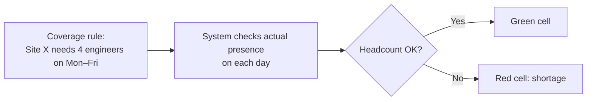
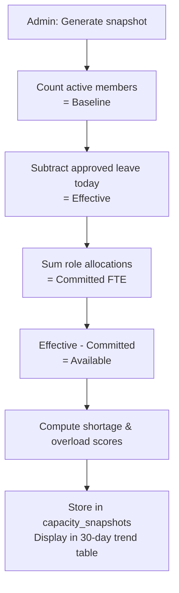

# Calendar and Capacity Planning

> **Summary**: The Calendar section gives you four views — leave calendar, annual grid, timeline, and coverage planner — plus Capacity DNA for daily workforce snapshots.

---

## Calendar Views

### Where to find it
**Workspace → Calendar tab**.

The Calendar tab has four sub-views selectable from the tab bar at the top:

| View | Best for |
|---|---|
| **Calendar** | Month-by-month leave overview with team colours |
| **Annual grid** | Full-year leave map per person (select member or self) |
| **Timeline** | Row-by-row Absentify-style daily grid with filters |
| **Coverage Planner** | Rule-vs-actual staffing by site and day |

---

## Leave Calendar

The main calendar view shows approved and pending leave requests colour-coded by type. You can filter by:
- Team
- Office / site
- Leave type
- Status
- Skills (capacity view)
- Location / city

Apply filters using the **Filters** panel (accordion-style; active filters show a purple badge with count).

---

## Annual Leave Grid

Shows a full-year grid with one row per day and colour-coded absence bars.

- Admins can switch between members using the **user selector** dropdown.
- The grid shows the quota summary: Allowance / Carried over / Used / Remaining.
- Colour legend matches leave types configured in your workspace.

---

## Timeline View

The Timeline is an Absentify-inspired row-per-person grid:
- Each row is a team member; columns are days.
- Cell status: on leave (colour), public holiday (grey), weekend (faint), working day (white).
- Virtualised rows — smooth even with 200+ members.
- Dynamic filter bar: team, position, skills, city.

The Timeline feeds the **Skill Capacity Report** — any active filter updates the real-time capacity aggregation automatically.

---

## Coverage Planner

### What it does
The Coverage Planner shows whether each site meets its daily headcount rule:



Each cell shows **required / actual** (e.g. "4 / 3"). Red cells signal a shortfall. Switch between weekly and monthly view using the toggle.

### Setting up coverage rules
1. Go to **Settings → Daily Coverage Rules**.
2. Click **Add rule**.
3. Select site, position(s), skill(s), required headcount, and days of week.
4. Save. The Coverage Planner now enforces this rule.

---

## Capacity DNA

### Where to find it
**Workspace → Resources → (bottom of Resources section)** — the Capacity DNA panel.

### What it does
Capacity DNA takes a daily snapshot comparing three figures:
- **Baseline**: number of active members
- **Effective**: baseline minus members on approved leave today
- **Committed**: sum of all role allocation percentages (FTE committed to roles)
- **Available**: effective minus committed
- **Shortage score**: how far below full coverage you are
- **Overload score**: how far above 100% committed you are

### How to use it
1. Click **Generate snapshot for today** (admin action).
2. The system computes the snapshot and stores it in `enterprise_capacity_snapshots`.
3. The last 30 daily snapshots appear as a compact table with trend icons (shortage ↑↓, overload ↑↓).



---

## Birthday & Anniversary Widget

The **Birthday & Anniversary Widget** (below the calendar) lists upcoming birthdays and work anniversaries. It collapses by default and shows a red badge when there are events in the next 7 days. Events within 7 days are highlighted with a tinted background.

---

## Troubleshooting

| Problem | Solution |
|---|---|
| Coverage cell always red | Check the rule configuration in Settings → Daily Coverage Rules. The rule may require more people than are in the workspace. |
| Timeline shows no members | Make sure at least one filter is not set to "none". Clear all filters to see everyone. |
| Annual grid shows wrong quota | Open the member's profile and check their quota assignments in Settings → Quota Manager. |
| Capacity DNA snapshot not updating | Only admins can generate snapshots. Check role. |

---

## Related
- Leave Requests
- Approval Flow
- Coverage Rules (Settings)
- Capacity DNA
- Skill Capacity Report (Timeline view)

---

## Metadata

```
version: 3.2.2
locale: en
topic_id: calendar-and-capacity
generated_by: curated-v1
```
