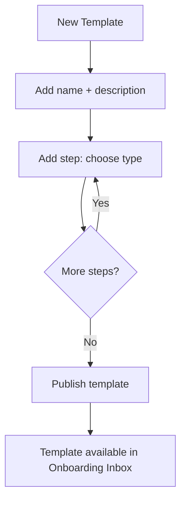
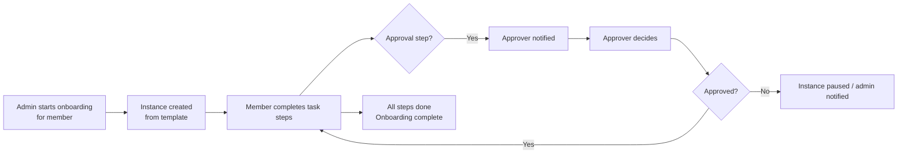
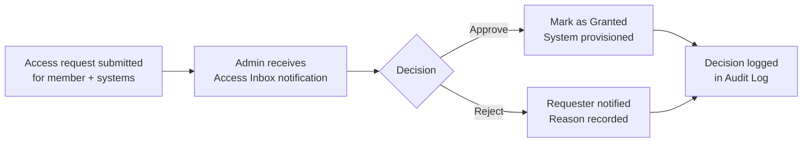

# Workflows: Onboarding and Access Requests

> **Summary**: The Workflows module manages structured onboarding playbooks for new team members and external access requests (Jira, Confluence, ERP, etc.).

---

## Where to find it
**Workspace → Workflows tab** (between Calendar and Resources).

The Workflows tab has five sub-tabs:
1. **Onboarding Templates** — define reusable onboarding plans
2. **Onboarding Inbox** — start and track onboarding instances per member
3. **Access Systems** — manage the external systems that members can request access to
4. **Access Templates** — pivot-matrix of position × system access bundles
5. **Access Inbox** — review and approve/reject pending access requests

---

## Onboarding Templates

### What it does
Templates are versioned onboarding plans with ordered steps. Each step has a type that drives the required action:

| Step type | Who acts | What happens |
|---|---|---|
| `task` | New member | Complete a manual task |
| `read` | New member | Read a document |
| `acknowledge` | New member | Sign an acknowledgement |
| `training` | New member | Complete training |
| `exam` | New member | Pass an exam |
| `approval` | Approver | Approve or reject a step |
| `internal_permission` | Admin | Grant internal system permission |
| `external_access` | Admin | Provision external system access |

### Creating an onboarding template



1. Go to **Workflows → Onboarding Templates**.
2. Click **New template**, enter a name.
3. Add steps using **Add step**. Set type, title, description, due offset (days from start), and for external_access steps pick the access system.
4. Click **Publish** to make the template active.

---

## Onboarding Inbox

The Onboarding Inbox is where admins start and monitor onboarding instances:

1. Click **Start onboarding** and select a member and a published template.
2. The instance appears in the list showing progress: `3/7 steps completed`.
3. Each step completion is recorded and can trigger approval steps automatically.
4. Click **Cancel** on an in-progress instance to abort.



---

## Access Systems

Access Systems define what external tools members can be provisioned to. Default systems (seeded on setup): Jira, Confluence, Outlook, Dynatrace, ERP, Billing, Entry Control.

Admins can:
- **Add** custom access systems
- **Archive** unused systems
- Click **Seed defaults** to restore the standard set

---

## Access Templates

Access Templates are position-level bundles that define which systems a member in a given role should get access to. The editor is a pivot matrix: rows = positions, columns = access systems. Toggle checkboxes to build the access bundle for each position.

When onboarding starts for a position with an access template, the required `external_access` steps are automatically included.

---

## Access Inbox

The Access Inbox lists all pending access request decisions:



Actions available per request: Approve, Reject, Mark Granted, Revoke.

---

## Troubleshooting

| Problem | Solution |
|---|---|
| Template not visible in Onboarding Inbox | The template may not be **Published** yet. Go to Templates and click Publish. |
| Access system not appearing in Access Templates | Ensure the system is added and **not archived** in Access Systems. |
| External access step shows no systems | Seed or add access systems first, then re-open the template step editor. |

---

## Related
- Approval Flow (approval steps use the same engine)
- Members (org unit and position assignment)
- Role Permissions

---

## Metadata

```
version: 3.2.2
locale: en
topic_id: workflows-onboarding-access
generated_by: curated-v1
```
