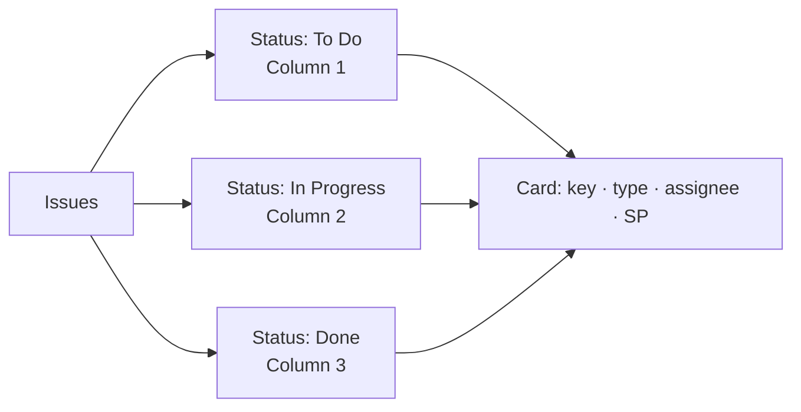
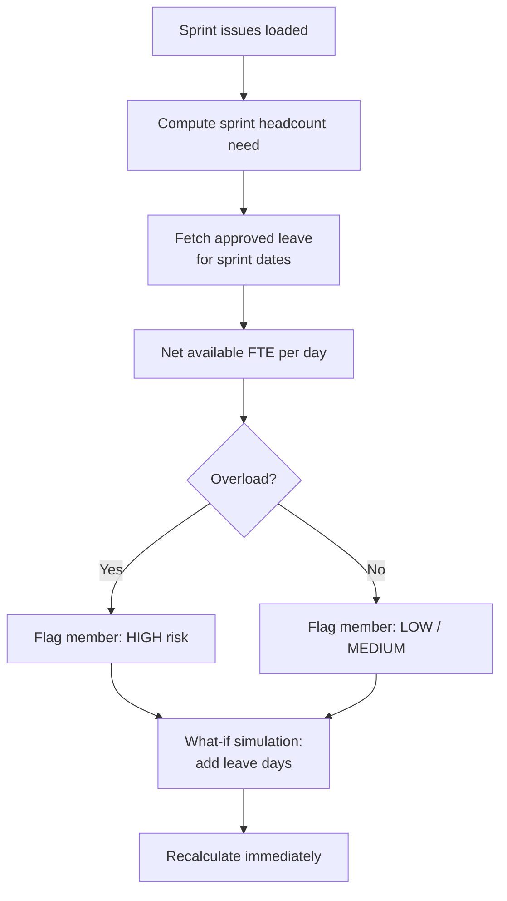

# Resources, Agile, and Capacity

> **Summary**: The Resources tab combines capacity heatmaps, project management, agile board integration (Jira / Azure DevOps), skill reporting, and scenario planning.

---

## Where to find it
**Workspace → Resources tab**.

Sub-tabs inside Resources:
| Sub-tab | Purpose |
|---|---|
| **Overview** | Capacity and resource summary dashboard |
| **Heatmap** | Day-by-day utilisation heatmap per member |
| **Projects** | Internal project list + Gantt timeline |
| **Agile** | Jira / Azure DevOps integration (Kanban, Scrum, Gantt) |
| **Skills** | Workspace skill catalog management |
| **Scenarios** | What-if scenario planner |
| **Financials** | Cost and financial data panel |
| **Capacity Gap** | Shortage / overload gap report |

Below the sub-tabs, two collapsible sections:
- **Position Management** (formerly in Settings)
- **Team Management** (formerly in Settings)

---

## Capacity Heatmap

The heatmap shows day-by-day availability across the team as a colour gradient (green = available, red = heavy leave). Use it to identify periods where capacity will be thin before committing to sprint plans or project deadlines.

---

## Projects and Gantt

### Where to find it
**Resources → Projects**.

Add internal projects with milestones and a Gantt timeline. Each project has:
- Name, description, owner
- Milestones with start and end dates
- Gantt view (horizontal bars on a month grid)

Projects in Resources are for internal planning; Jira/ADO projects sync through the Agile integration.

---

## Agile — Jira and Azure DevOps

### Connecting a project
See the **Jira & Azure DevOps Integration** article for setup steps.

### Three board views

#### Kanban



Issues are grouped by their current status. Cards show: issue key, type chip (Bug=red, Epic=purple, Story=emerald, Task=sky), assignee avatar, story points, priority icon.

#### Scrum

Issues are grouped first by sprint, then by status within each sprint. The sprint header shows ticket count and total story points — useful for sprint review and planning.

#### Gantt

Issues plotted as horizontal bars on a monthly timeline using `start_date` and `due_date`. Type-colour-coded (same as Kanban). Scroll horizontally to navigate months.

### Capacity Fit

The Capacity Fit panel compares sprint headcount demand against actual team availability (factoring in leave). It shows overload and underload per member and supports **what-if simulations**: enter hypothetical extra leave days and instantly see the recalculated capacity.



### Backlog Browser

Search issues using:
- **JQL** (Jira Query Language) — e.g. `project = MYPROJ AND sprint in openSprints()`
- **WIQL** (Azure DevOps Work Item Query Language)

Results are cached in `enterprise_agile_issues` for offline availability.

### Issue Writeback

Create or update issues directly from Effectime:
1. Go to **Agile → Issue Writeback**.
2. Select integration (Jira or ADO).
3. Fill in summary, issue type, assignee, sprint, labels, story points.
4. Click **Create** or **Update**.
5. The action is logged in `enterprise_agile_sync_log`.

---

## Skill Capacity Report

When the Timeline view has active filters, the **Skill Capacity Report** updates in real time to show:
- Summary cards: Filtered members · Available · On approved leave · Availability %
- Per-skill availability progress bars (colour = skill's hex code)
- Per-position capacity chart (available vs. on leave)

---

## Scenario Planner

The Scenario Planner lets you model workforce changes (adding members, changing allocations, removing roles) and immediately see the capacity impact — without modifying live data.

---

## Troubleshooting

| Problem | Solution |
|---|---|
| Agile board empty | Run **Sync** or check the integration health in Settings. |
| Gantt bars missing | Issues may lack `start_date` or `due_date` in Jira. Set them and re-sync. |
| Capacity Fit shows 0 members | Ensure there are active role allocations set on member profiles. |
| Skills manager shows no skills | Go to **Resources → Skills** and add skills, or check workspace role skill catalog. |

---

## Related
- Jira Integration
- Integration Health Center
- Calendar (leave data source for capacity)
- Coverage Planner

---

## Metadata

```
version: 3.2.2
locale: en
topic_id: resources-agile-capacity
generated_by: curated-v1
```
