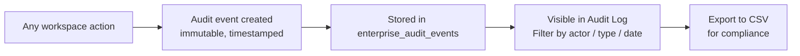

# Reports, Audit Log, and Export

> **Summary**: Track team health with KPI dashboards, investigate actions in the immutable audit log, and export data as CSV for payroll or compliance.

---

## Where to find it
**Workspace → Reports tab**.

Sub-tabs:
| Sub-tab | Purpose |
|---|---|
| **Dashboard** | KPI summary cards, leave trend and status charts |
| **Audit** | Immutable audit log — filter, search, view events |
| **Export** | Download CSV files for any date range |
| **Scheduled** | Configure automatic recurring report delivery |

---

## Reports Dashboard

The dashboard shows summary metrics for the workspace:

| Metric | Description |
|---|---|
| Total members | Active member count |
| Pending approvals | Requests awaiting decision |
| Approved leave days | Approved leave in the selected period |
| Rejection rate | Ratio of rejected to total requests |
| Leave by status | Pie chart: pending / approved / rejected / cancelled |
| Leave by type | Bar chart: vacation / sick / unpaid / custom |
| Daily absentees | Line chart of people on leave per day |

Use the date range selector to adjust the reporting period.

### Pinned Report Widgets
Admins can **pin** any report widget to the workspace overview using the **Pin to Reports** action. Pinned widgets appear at the top of the dashboard for quick access.

---

## Audit Log

### What it does
The audit log is an **immutable** record of every significant action in the workspace. It cannot be edited, deleted, or retroactively modified. Events include:

- Leave request submitted / approved / rejected / cancelled
- Member invited / role changed / archived
- Approval chain configured
- Settings changed
- Integration connected / archived
- Workspace recovery mode activated / deactivated

### How to use it

1. Open **Reports → Audit**.
2. Use the **event type** filter to narrow by category.
3. Use the **actor** filter to see only events by a specific user.
4. Use the **date range** picker to scope the period.
5. Each event row shows: timestamp, actor, event type, description, and metadata.



---

## Export Center

### How to export data

1. Open **Reports → Export**.
2. Select **Export type**: Leave data or Audit log.
3. Set **date range** (from → to).
4. Optionally filter leave data by **status** (approved only is common for payroll).
5. Click **Export CSV** — the file downloads immediately.
6. The export action is itself logged in the audit trail.

### CSV format
- UTF-8 BOM encoding (Excel-compatible)
- Headers in English regardless of UI language
- Date format: ISO 8601 (YYYY-MM-DD)

### What fields are included (Leave export)
`request_id, member_name, email, leave_type, start_date, end_date, days, status, submitted_at, decided_at, decided_by, note`

---

## Scheduled Reports

Admins can configure automatic report delivery:
1. Go to **Reports → Scheduled**.
2. Click **New scheduled report**.
3. Choose report type, frequency (daily / weekly / monthly), and recipient email(s).
4. Save. The `send-scheduled-reports` edge function delivers on schedule.

---

## Troubleshooting

| Problem | Solution |
|---|---|
| Audit log missing events | The log shows the last 100 events by default. Use date range to see older events or export the full log. |
| Export file empty | Check that the selected date range and status filter match existing data. |
| Scheduled report not arriving | Check spam; verify the recipient email is correct. Contact your admin to check the scheduled report configuration. |

---

## Related
- Leave Requests and Approvals
- Quota Manager
- Decision Memory (for admin-annotated decisions)
- Command Center (at-a-glance counters)

---

## Metadata

```
version: 3.2.2
locale: en
topic_id: reports-audit-export
generated_by: curated-v1
```
