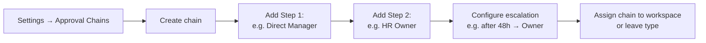
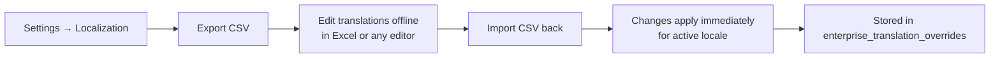

# Settings and Administration

> **Summary**: The Settings tab is your workspace control panel. It covers branding, leave rules, integrations, role permissions, localization, recovery mode, and more.

---

## Where to find it
**Workspace → Settings tab** (last tab; visible to all, but most sections are admin-only).

---

## Settings sections overview

| Section | Who can change it | What it configures |
|---|---|---|
| General | Owner | Workspace name, description, branding |
| Leave Types | Owner / Resource Assistant | Custom leave type labels and colours |
| Holidays | Owner / Resource Assistant | Public holidays and blocked dates |
| Daily Coverage Rules | Owner / Resource Assistant | Site-level staffing rules |
| Rule Templates | Owner / Resource Assistant | Reusable rule template library |
| Approval Chains | Owner | Multi-step approval configuration and escalation |
| Calendar Filters | Owner / Resource Assistant | Filter order and enable/disable per workspace |
| Role Permissions | Owner | Feature access per role |
| Integrations | Owner | Jira, Azure DevOps connections |
| iCal Subscription | All | Personal iCal feed URL |
| Localization | Owner / Resource Assistant | Language, CSV import/export |
| Recovery Mode | Owner | Activate/deactivate workspace recovery state |
| Integration Health | Owner | View integration status and logs |

---

## Leave Types

1. Go to **Settings → Leave Types**.
2. Click **Add type**, enter a label and choose a colour.
3. Save. The new type appears in the leave request form for all members.
4. Archive a type to hide it from new requests (existing requests are unaffected).

---

## Holidays and Blocked Dates

- **Public Holidays**: dates that count as non-working days; leave requests on these dates generate a conflict warning.
- **Blocked Dates**: dates no one can take leave (e.g. mandatory company-wide presence days).

Add holidays one by one or import from an external holiday source.

---

## Approval Chains



Each step in a chain can target:
- A specific user
- A role (e.g. all Resource Assistants)
- The member's direct manager

Escalation rules define what happens if a step isn't acted on within N hours.

---

## Role Permissions

The Role Permissions editor shows a tree structure that mirrors the application's navigation:

- Check **View** to allow a role to see that feature.
- Check **Edit** to allow writes.

The tree is driven by the `enterprise_feature_catalog` table and automatically reflects new features added to the application. Unconfigured permissions default to the role's baseline.

---

## Localization Settings

### Switching language
Click the **flag button** in the top-right header (not in Settings) to switch the UI language immediately. The choice is persisted to your profile.

### Workspace default language
Admins can set a workspace default in **Settings → Localization**. New members and outgoing emails use this default until the member sets their own preference.

### Translation CSV export / import



1. Click **Export CSV** — downloads `effectime-i18n-YYYY-MM-DD.csv` with columns `key, en, hu`.
2. Edit the file in Excel or any text editor. Change values in the `en` or `hu` columns.
3. Click **Import CSV** and upload the file.
4. A summary confirms: `N new · N updated · N skipped`.
5. Changes apply immediately without redeploying.

Missing-key counters are shown live: total keys / missing in HU / missing in EN.

---

## Integration Health Center

Shows the health status of each connected external system:
- **Healthy** (green): last 5 sync calls succeeded
- **Degraded** (amber): some recent failures
- **Failed** (red): all recent calls failed
- **Unknown** (grey): not yet synced

Click any integration row to see the three most recent error excerpts.

---

## Recovery Mode

Recovery Mode is an operational flag that signals the workspace is in an exceptional state (e.g. security incident, data remediation, planned maintenance).

- When active, the **Command Center widget** switches to a destructive-tinted (red) appearance as a visual warning.
- Activation requires an Owner role and a written reason.
- The activation timestamp and activating user are recorded.

Activate: **Settings → Recovery Mode → Activate** → enter reason → confirm.
Deactivate: **Settings → Recovery Mode → Deactivate**.

---

## Command Center

The Command Center widget appears at the top of the workspace dashboard (admins only). It shows four live counters:

| Counter | Navigates to |
|---|---|
| Pending leave approvals | Approvals tab |
| In-progress onboarding instances | Workflows → Onboarding Inbox |
| Pending access requests | Workflows → Access Inbox |
| Members with incomplete org metadata | Members tab (filtered) |

The counters refresh every 90 seconds. When Recovery Mode is active, the widget renders with a red-tinted border.

---

## Decision Memory

The Decision Memory editor lets admins attach a structured annotation to any decision:
- **Subject**: what the decision was about (approval ID, scenario, access grant)
- **Rationale**: why this decision was made
- **Expected outcome**: what should happen as a result
- **Observed outcome**: filled in after the fact (triggered by the Decision Memory Inbox)

The **Decision Memory Stale Inbox** (Approvals section) lists every annotation where the observation window (14 days by default) has elapsed and no observed outcome has been captured yet. Admins close the loop by filling in the outcome inline.

---

## Troubleshooting

| Problem | Solution |
|---|---|
| Can't see Settings sections | Most settings sections require Owner or Resource Assistant role. Check your role. |
| Language switch not persisting | Make sure you are signed in. Guest/incognito sessions revert on reload. |
| CSV import failing | Check that the file has the correct header: `key,en,hu`. Re-export a fresh CSV to use as a template. |
| Integration health always Unknown | The integration may never have synced. Trigger a manual sync from the Agile panel. |

---

## Related
- Role Permissions
- Localization Settings
- Integration Health
- Command Center
- Approval Chains

---

## Metadata

```
version: 3.2.2
locale: en
topic_id: settings-admin
generated_by: curated-v1
```
