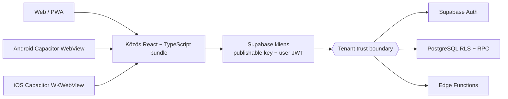

# Effectime Android/iOS foundation

## Dokumentum státusza

- **BIZONYÍTOTT:** ez a dokumentum a repositoryban jelenleg megvalósított
  Capacitor 8 foundation átadási és architektúra-leírása.
- **BIZONYÍTOTT:** az Android- és iOS-projekt forrása létezik, de ez még nem
  jelent aláírt, store-ban lefoglalt vagy készüléken elfogadott mobil release-t.
- **BIZONYÍTOTT:** a store release döntése jelenleg **NO-GO**. A blokkoló
  feltételeket a [Store release kapuk](#store-release-kapuk-no-go) rész sorolja.
- **BIZONYTALAN:** a végleges store-tulajdonosok, signing team-ek, certificate-ek
  és provisioning adatok nem állapíthatók meg a repositoryból; ezekről az arra
  jogosult embernek kell döntenie.

A bizonyossági címkék jelentése:

- **BIZONYÍTOTT:** közvetlenül igazolható a repositoryból vagy lefuttatott
  ellenőrzésből.
- **VALÓSZÍNŰ:** a jelenlegi kód és termékidentitás erősen alátámasztja, de külső
  store-, DNS- vagy account-állapot még nem igazolja.
- **BIZONYTALAN:** külső hozzáférés vagy termék-/biztonsági döntés szükséges.

## Architektúra és adatforrás



- **BIZONYÍTOTT:** a web, Android és iOS ugyanazt a React/Vite forrást és üzleti
  logikát használja. A Capacitor a külön CSP-hardened `dist-mobile` artifactot
  csomagolja; Android és iOS byte-azonos mobil buildet kap, miközben a webes
  `dist` SEO/PWA szerződése változatlan. Production `server.url` vagy cleartext
  override nincs
  ([`capacitor.config.ts`](../../capacitor.config.ts)).
- **BIZONYÍTOTT:** mindhárom kliens ugyanazt a Supabase klienst és ugyanazokat a
  build-time publikus változókat használja: `VITE_SUPABASE_URL` és
  `VITE_SUPABASE_PUBLISHABLE_KEY`
  ([`client.ts`](../../src/integrations/supabase/client.ts),
  [`.env.example`](../../.env.example)). Külön mobil adatbázis vagy mobil-specifikus
  üzleti API nincs.
- **BIZONYÍTOTT:** a kliens és a mobil binary nem bizalmi határ. A publishable
  kulcs nyilvános klienskonfiguráció; a felhasználói JWT, a PostgreSQL RLS/RPC és
  az Edge Function authorization együtt védi a workspace/tenant adatokat.
- **BIZONYÍTOTT:** service-role kulcs, provider secret, signing private key vagy
  más szerveroldali titok nem kerülhet `VITE_*` változóba, JavaScript bundle-be,
  native resource-ba vagy logba.
- **BIZONYÍTOTT:** a natív kliens nem kap külön tenant-jogosultságot. Minden
  workspace ID és rekordazonosító támadó által módosíthatónak tekintendő; a
  szerveroldali tenant-izolációt a mobil UI nem helyettesítheti.
- **VALÓSZÍNŰ:** a canonical publikus origin productionben
  `https://effectime.app`. Ezt a `VITE_PUBLIC_APP_ORIGIN` adja meg, és ez szolgál
  a WebView lokális originjét elhagyni képes meghívó-, booking- és embed linkek
  alapjául ([`mobile.ts`](../../src/lib/platform/mobile.ts)).

## Alkalmazásidentitás és platform ownership

- **VALÓSZÍNŰ:** a javasolt Android Application ID és iOS Bundle ID
  `app.effectime`; a megjelenített név `Effectime`
  ([`capacitor.config.ts`](../../capacitor.config.ts),
  [`android/app/build.gradle`](../../android/app/build.gradle),
  [`ios/App/App.xcodeproj/project.pbxproj`](../../ios/App/App.xcodeproj/project.pbxproj)).
- **VALÓSZÍNŰ:** a jelenlegi custom URL scheme szintén `app.effectime`, így az
  auth callback alap-URI-ja pontosan:

  ```text
  app.effectime://auth/callback
  ```

- **BIZONYTALAN / NO-GO:** az `app.effectime` azonosító App Store Connect- és
  Google Play Console-foglalása nem bizonyított. Production signing vagy külső
  terjesztés előtt mindkét store-ban, a megfelelő jogi tulajdonos accountjában
  ellenőrizni és lefoglalni kell.
- **BIZONYÍTOTT:** publikálás után az alkalmazásazonosító megváltoztatása új
  alkalmazásidentitást jelenthet. Ezért az ID-t csak explicit release-döntéssel
  szabad módosítani.
- **BIZONYÍTOTT:** az `android/` és `ios/` könyvtárak review-zandó
  termékforrások, nem egyszer használatos build outputok. A teljes natív,
  CI-, teszt- és dokumentációs csomag külön candidate commitokban rögzítve van.
- **BIZONYÍTOTT:** a `cap sync` által kezelt plugin- és webasset-fájlok mellett a
  manifest, entitlements, signing, privacy és store-verzió beállítások platform
  source-of-truthként is működnek. Minden sync után a natív diffet is review-zni
  kell.
- **BIZONYÍTOTT:** keystore, certificate, `.p12`, provisioning profile,
  `local.properties` és signing-property nem kerülhet gitbe; a root
  [`.gitignore`](../../.gitignore) ezeket kizárja.

## Toolchain

### Közös

- **BIZONYÍTOTT:** Node.js `>=22.9.0` és npm `11.13.0` szükséges
  ([`package.json`](../../package.json)).
- **BIZONYÍTOTT:** a Capacitor runtime/platform csomagok és a CLI exact verzióra
  vannak rögzítve. A jelenlegi foundation Capacitor `8.3.1`-et használ; az App és
  Browser pluginok verziója a lockfile source-of-truthja.
- **BIZONYÍTOTT:** a natív Supabase session adapter exact-pinned
  `@aparajita/capacitor-secure-storage@8.0.0` csomagot használ (MIT). Androidon
  AndroidKeyStore-backed AES-GCM, iOS-en Keychain `whenUnlockedThisDeviceOnly`
  és kikapcsolt Keychain-szinkronizáció a szerződés. A dependency egy
  maintainerhez kötődő supply-chain kockázat; az exact lock/integrity, npm audit,
  SBOM és plugin-allowlist ezért kötelező.
- **BIZONYÍTOTT:** kizárólag publikus Supabase klienskonfiguráció másolható
  `.env.local` fájlba.

```powershell
Copy-Item .env.example .env.local
npm ci
npm run typecheck
npm run mobile:check:source
```

Unix shellben az első parancs megfelelője:

```sh
cp .env.example .env.local
```

### Android Windows/macOS/Linux

- **BIZONYÍTOTT:** a projekt minimum API 24-et, compile/target API 36-ot és a
  repositoryban rögzített Gradle wrappert használ
  ([`variables.gradle`](../../android/variables.gradle),
  [`gradle-wrapper.properties`](../../android/gradle/wrapper/gradle-wrapper.properties)).
- **BIZONYÍTOTT:** Android Studio, Android SDK platform 36, build-tools, egy API
  24+ emulator vagy fizikai eszköz szükséges. A signing nélküli debug build nem
  bizonyít store-release képességet.

```powershell
npm run mobile:sync:android
npm run mobile:open:android
Push-Location android
.\gradlew.bat testDebugUnitTest lintDebug assembleDebug --no-daemon
Pop-Location
```

macOS/Linux terminálon:

```sh
npm run mobile:sync:android
cd android
./gradlew testDebugUnitTest lintDebug assembleDebug --no-daemon
```

### iOS kizárólag macOS-en

- **BIZONYÍTOTT:** a generált projekt iOS 15 minimumot és Swift Package Managert
  használ ([`Package.swift`](../../ios/App/CapApp-SPM/Package.swift)).
- **BIZONYÍTOTT:** Capacitor 8-hoz Node 22+, Xcode 26+ és Xcode Command Line Tools
  szükséges. Windows alatt az iOS-projekt forrása előkészíthető, de fordítása,
  signingja és készülékes validációja nem igazolható.
- **BIZONYTALAN / NO-GO:** a jelenlegi iOS scaffold macOS/Xcode fordítása még
  nem bizonyított.
- **BIZONYÍTOTT:** a sync utáni normalizáló kapu a Windows által generált `\`
  SPM útvonalakat determinisztikus `/` formára alakítja. **NO-GO:**
  `Package.resolved` csak macOS/Xcode resolve után keletkezhet, és ugyanazon
  candidate SHA részeként review-zni és commitolni kell.

```sh
npm ci
npm run mobile:sync:ios
npm run mobile:open:ios
xcodebuild \
  -resolvePackageDependencies \
  -project ios/App/App.xcodeproj \
  -scheme App
npm run mobile:check:release
xcodebuild \
  -project ios/App/App.xcodeproj \
  -scheme App \
  -configuration Debug \
  -sdk iphonesimulator \
  -onlyUsePackageVersionsFromResolvedFile \
  CODE_SIGNING_ALLOWED=NO \
  build
```

## Build és sync parancsok

| Parancs                       | Bizonyított feladat                                                                      |
| ----------------------------- | ---------------------------------------------------------------------------------------- |
| `npm run build:mobile`        | Külön CSP-hardened `dist-mobile` artifact előállítása a közös React forrásból.            |
| `npm run mobile:check:source` | Buildfüggetlen clean-checkout forrás-, identity-, auth- és CI-szerződéskapu.               |
| `npm run mobile:check`        | Kötelező build/sync artifact, CSP, plugin és teljes fájdfa SHA-256 kapu.                   |
| `npm run mobile:check:release`| A fentieken túl commitolt natív forrást és review-zott iOS dependency lockot követel.     |
| `npm run test:e2e:mobile`     | Friss mobile build, majd bridge-emulált landing/auth secure-store/CSP smoke.               |
| `npm run test:e2e:mobile:built` | Már review-zott build E2E-je; CI-ben használható új build nélkül.                       |
| `npm run mobile:sync`         | Mobile build, majd ugyanazon artifact Android+iOS szinkronja.                             |
| `npm run mobile:sync:android` | Mobile build és kizárólag Android sync.                                                   |
| `npm run mobile:sync:ios`     | Mobile build és kizárólag iOS sync; érdemi release-validáció macOS-en szükséges.          |
| `npm run mobile:open:android` | Az Android projekt megnyitása Android Studióban.                                          |
| `npm run mobile:open:ios`     | Az iOS projekt megnyitása Xcode-ban; csak macOS-en használható.                           |

- **BIZONYÍTOTT:** `mobile:sync*` futtatás előtt a Vite build beégeti a kiválasztott
  publikus backendkonfigurációt. Ugyanahhoz a release-hez Android és iOS alatt
  ugyanazt az ellenőrzött környezeti profilt kell használni.
- **BIZONYÍTOTT:** a majdani production candidate a csomagolt `dist-mobile`
  artifactot használja. A
  `server.url`, `cleartext` vagy távoli live-reload URL visszaállítása nem
  elfogadható production rollback.

## Secure session storage és natív CSP

### Supabase session storage

- **BIZONYÍTOTT:** weben a meglévő `localStorage` kompatibilitás marad; natív
  runtime-ban a Supabase kizárólag az OS secure store adaptert kapja
  ([`nativeAuthStorage.ts`](../../src/lib/platform/nativeAuthStorage.ts)). Nincs
  localStorage- vagy memóriás fallback secure-store hiba esetén.
- **BIZONYÍTOTT:** az explicit stabil storage key
  `sb-<VITE_SUPABASE_PROJECT_ID>-auth-token`; csak a session,
  `-code-verifier` és `-user` kulcs engedélyezett. Custom Supabase domain mellett
  is a konfigurált project ID tartja stabilan az identitást.
- **BIZONYÍTOTT:** a három nyers Supabase-string egy verziózott, projecthez kötött
  envelope-ban tárolódik. Minden read-modify-write mutex alatt fut, és a cache
  csak byte-azonos secure write/readback után frissül.
- **BIZONYÍTOTT:** legacy natív localStorage migrációnál a secure commit és
  visszaolvasás megelőzi a legacy törlést. Hiba esetén nincs csendes tokenvesztés
  vagy gyengébb fallback. Secure/legacy konfliktusban a secure állapot az
  autoritatív.
- **BIZONYÍTOTT kódban és tesztben; BIZONYTALAN készüléken:** mivel az iOS
  Keychain túlélheti az uninstallt, sandbox install
  marker védi az újratelepítést: marker nélküli, migrálható legacy állapot nélküli
  régi session törlődik, és új login szükséges.
- **BIZONYÍTOTT:** a Supabase auth lock szerződése támogatja a `0 ms`
  non-blocking auto-refresh próbát (`isAcquireTimeout`), így normál lock-verseny
  nem aktiválja tévesen a recovery UI-t.
- **BIZONYÍTOTT:** storage/config/migrációs hiba blokkoló, kétnyelvű fail-closed
  képernyőt ad biztonságos hibakóddal. A helyi session törlése kétlépcsős
  megerősítést igényel; token, plugin- vagy OS-részlet nem kerül a logba.
- **BIZONYÍTOTT:** explicit reset kezdetétől reloadig minden késői auth-írás
  blokkolt. Minden legacy tokenkulcs külön törlési kísérletet kap; a verified
  üres secure envelope autoritatív tombstone-ként megakadályozza a stale legacy
  session újramigrálását. Secure delete-fallback csak tartós pending marker vagy
  bizonyítottan teljes legacy-törlés mellett engedélyezett.
- **BIZONYÍTOTT:** hálózati/5xx logout hiba nem látszik sikernek: az eredményt a
  kliens ellenőrzi, az összes helyi Supabase credentialt egy validált mutációban
  törli, majd a távoli revokáció hibáját felhasználói warningként jelzi.

### WebView Content Security Policy

- **BIZONYÍTOTT:** a mobile build a validált Supabase HTTPS originből állít elő
  exact `connect-src` HTTPS/WSS allowlistet. Nincs wildcard Supabase,
  `unsafe-eval` vagy script `unsafe-inline`.
- **BIZONYÍTOTT:** a natív indexből kimarad a webes JSON-LD, `noscript`, manifest,
  service-worker és preconnect tartalom. Néhány platform-meta megmarad; a webes
  `dist` SEO/PWA artifactja ettől nem változik.
- **BIZONYÍTOTT:** a mobil shell csak külső module scriptet enged; style
  `unsafe-inline` a meglévő React/chart inline style szerződés miatt marad.
  **KÖZEPES ADATVÉDELMI ADÓSSÁG:** a Google Fonts külső hálózati függőség, az
  `img-src https:` pedig minden HTTPS képforrást enged a tenant-branding miatt;
  self-hosted font és validált image proxy/allowlist külön hardening csomag.
- **BIZONYÍTOTT:** `mobile:check` a `dist-mobile`, Android és iOS teljes relatív
  fájdfáját és minden fájl SHA-256 hashét összehasonlítja, ellenőrzi a CSP-t, a
  web-only assetek hiányát, valamint az exact Android/iOS plugin allowlistet. A
  transitive Capacitor Keyboard egyik platformon sincs regisztrálva.
- **BIZONYÍTOTT lokálisan, készüléken még BIZONYTALAN:** Playwright Android
  bridge-emulációban a landing és auth 2/2 zöld, nulla CSP-, konzol-, oldal- vagy
  **lokális** asset hibával. A teszt nem állítja, hogy minden külső font/kép
  elérhető; valódi Android WebView és iOS WKWebView smoke továbbra is release-kapu.

## Auth, PKCE, system browser és deep link

### Megvalósult folyamat

- **BIZONYÍTOTT:** natív platformon a Supabase kliens PKCE flow-t használ,
  kikapcsolja az automatikus URL-session detektálást, és az App lifecycle alapján
  indítja/leállítja a token auto-refresh-t
  ([`client.ts`](../../src/integrations/supabase/client.ts),
  [`MobileRuntimeBridge.tsx`](../../src/components/mobile/MobileRuntimeBridge.tsx)).
- **BIZONYÍTOTT:** Google OAuth esetén a kliens `skipBrowserRedirect` módban kéri
  az authorization URL-t, csak a konfigurált Supabase HTTPS originen lévő
  `/auth/v1/authorize` útvonalat fogadja el, majd a Capacitor Browser pluginban
  nyitja meg ([`Auth.tsx`](../../src/pages/Auth.tsx)).
- **BIZONYÍTOTT:** cold start esetén `getLaunchUrl`, futó alkalmazásnál
  `appUrlOpen` továbbítja a callbacket. A bridge a PKCE code-ot
  `exchangeCodeForSession` hívással váltja sessionre, deduplikálja a rövid időn
  belüli ismétlést, és csak allowlistelt belső route-ra navigál.
- **BIZONYÍTOTT:** a natív callback kizárólag PKCE authorization code-ot fogad.
  Bármely custom-scheme vagy canonical HTTPS link `access_token` vagy
  `refresh_token` paraméterét — az általános `/auth` route-on is — fail-closed
  elutasítja, mert az
  implicit fallback login-CSRF/session-swap kockázatot jelentene. A webes legacy
  implicit callback kompatibilitása ettől változatlan marad.
- **BIZONYÍTOTT:** recovery callbacknél a bridge csak sikeres kódcserét követően,
  belső router-state-tel jelöli a jelszó-visszaállítási szándékot; a reset oldal
  emellett meglévő sessiont is ellenőriz.
- **BIZONYÍTOTT:** a PWA service worker és install prompt natív runtime-ban nem
  indul el, így nem hoz létre a WebView-ben külön webes cache-életciklust
  ([`registerSW.ts`](../../src/lib/pwa/registerSW.ts),
  [`InstallPwaPrompt.tsx`](../../src/components/pwa/InstallPwaPrompt.tsx)).

### Supabase URL-konfiguráció

- **VALÓSZÍNŰ:** a production Supabase **Site URL** értéke:

  ```text
  https://effectime.app
  ```

- **BIZONYÍTOTT a kódban, külső dashboardban BIZONYTALAN:** a Supabase
  Authentication → URL Configuration → **Redirect URLs** listába pontosan ezt a
  callback-prefixet kell felvenni. A szűk suffix-glob azért szükséges, mert a
  kliens ugyanazon a fix host/path értéken `flow` és allowlistelt belső
  `redirect` query paramétert ad át, a Supabase pedig hibát vagy PKCE-kódot fűz
  hozzá:

  ```text
  app.effectime://auth/callback**
  ```

  Ne kerüljön mellé `capacitor://localhost`, Lovable preview URL, más host/path
  vagy általános scheme wildcard. A production allowlistet a
  [Supabase redirect URL dokumentáció](https://supabase.com/docs/guides/auth/redirect-urls)
  alapján kell felvenni és stagingben igazolni.

- **BIZONYTALAN / NO-GO:** a redirect tényleges felvétele és end-to-end működése
  a kiválasztott production Supabase projektben nincs bizonyítva.
- **BIZONYÍTOTT:** a Google provider konzolban használt provider callback nem a
  custom scheme. Annak a kiválasztott Supabase projekt HTTPS callbackjére kell
  mutatnia:

  ```text
  https://<project-ref>.supabase.co/auth/v1/callback
  ```

  A `<project-ref>` csak a tényleges production project inventoryból vehető át;
  nem található ki és nem helyettesíthető staging értékkel.

### Verified HTTPS link célállapot

- **BIZONYÍTOTT:** a JavaScript parser elő van készítve a canonical
  `https://effectime.app/auth/mobile-callback` és allowlistelt HTTPS alkalmazáslinkek
  fogadására.
- **BIZONYÍTOTT:** a jelenlegi natív manifestek csak az `app.effectime` custom
  scheme-et regisztrálják. Android `autoVerify` App Link, iOS Associated Domains,
  `assetlinks.json` és `apple-app-site-association` még nincs kész.
- **BIZONYTALAN / NO-GO:** verified link csak az Apple Team ID, a végleges Bundle
  ID, az Android release/Play signing certificate SHA-256 fingerprint és a
  production domain ownership ismeretében aktiválható.
- **VALÓSZÍNŰ:** a verified HTTPS callback a hosszú távú biztonságos cél, mert a
  custom scheme-et más alkalmazás is megpróbálhatja regisztrálni. Átálláskor a
  custom scheme-et csak explicit kompatibilitási időablakban szabad fenntartani.

## CI és validáció

### Kötelező merge gate

```sh
npm ci
npm run security:secrets
npm run mobile:check:source
npm run typecheck
npx vitest run src/test/internalPath.test.ts src/test/mobileFoundation.test.ts src/test/mobileRuntimeBridge.test.tsx src/test/publicRuntime.test.ts src/test/nativeAuthStorage.test.ts src/test/mobileCsp.test.ts src/test/authStorageRecovery.test.tsx
npm run test:coverage
npm run build
npm run bundle:check
npm run test:e2e:built
npm run mobile:sync
npm run mobile:check
npm run test:e2e:mobile:built
```

- **BIZONYÍTOTT:** a mobil unit/contract suite ellenőrzi az origin-normalizálást,
  open-redirect védelmet, PKCE callbacket, az implicit-token callback tiltását,
  recovery state-et, cold/warm startot, callback-deduplikációt, Supabase OAuth URL
  allowlistet, production-safe Capacitor configot és a PWA/native elválasztást
  ([`mobileFoundation.test.ts`](../../src/test/mobileFoundation.test.ts),
  [`mobileRuntimeBridge.test.tsx`](../../src/test/mobileRuntimeBridge.test.tsx),
  [`nativeAuthStorage.test.ts`](../../src/test/nativeAuthStorage.test.ts),
  [`mobileCsp.test.ts`](../../src/test/mobileCsp.test.ts),
  [`authStorageRecovery.test.tsx`](../../src/test/authStorageRecovery.test.tsx),
  [`publicRuntime.test.ts`](../../src/test/publicRuntime.test.ts) és
  [`internalPath.test.ts`](../../src/test/internalPath.test.ts)).
- **BIZONYÍTOTT:** a jelenlegi célzott eredmény 93/93 sikeres teszt; a
  `mobile:check:source` 183/183, a build/sync utáni `mobile:check` 343/343
  fail-closed assertionnel zöld. A 4 077 modulos mobile
  build, a 2/2 natív E2E és mindkét `cap sync` szintén sikeres volt ezen a
  munkafán.
- **BIZONYÍTOTT / PASS KORLÁTTAL:** a helyi Windows Android
  `testDebugUnitTest lintDebug assembleDebug --no-daemon --stacktrace` lánc a
  telepített Android Studio SDK-val 3 perc 42 másodperc alatt 276 taskot futtatott,
  `BUILD SUCCESSFUL` eredménnyel. Nincs új lint finding; a debug APK 6 049 206
  byte, SHA-256 `EFA6125663E4D0BFF4EE02C2A318C5D90F9A22DE0F90041C3339FF8AF61F05D7`.
  Az app és a bevont pluginok unit taskjai `NO-SOURCE`, ezért ez fordítási,
  lint- és csomagolási bizonyíték, nem natív unit vagy készülékes lefedettség.
- **BIZONYÍTOTT forrásban:** a commitolt általános quality workflow
  Node 22-n az alábbi kapuk futtatására van konfigurálva: dependency
  auditot, secret scant, `mobile:check` contractot, typechecket, coverage suite-ot,
  buildet, bundle-kaput és böngészős smoke teszteket
  ([`quality.yml`](../../.github/workflows/quality.yml)).
- **BIZONYÍTOTT:** ugyanebben a workflow-forrásban külön SHA-pinnelt
  `android-compile` és `ios-compile` job is létezik; **BIZONYTALAN:**
  GitHub-hosted futási bizonyíték még nincs.
- **BIZONYÍTOTT forrásban:** lock nélküli első PR-en az iOS job Xcode-dal
  létrehozza és artifactként feltölti a `Package.resolved` fájlt, majd
  szándékosan leáll. A következő candidate csak review-zott, commitolt lockkal,
  a strict release gate után és `-onlyUsePackageVersionsFromResolvedFile`
  módban fordulhat; az Xcode által okozott tracked vagy untracked iOS drift tiltott.
- **BIZONYÍTOTT:** a böngészős E2E és a statikus mobil contract nem helyettesíti
  a Gradle-, Xcode-, emulator- vagy fizikai eszköztesztet.

### Kötelező natív release evidence

- **BIZONYÍTOTT / NO-GO:** `npm run mobile:check:release` clean, commitolt
  candidate forráson 1/352 hibával áll meg: hiányzik az Xcode által generált
  `Package.resolved`. A kapu csak review-zott és commitolt iOS lock mellett válhat
  zölddé.

- **RÉSZBEN BIZONYÍTOTT:** a lokális Android Gradle compile/lint/debug build zöld;
  **NO-GO**, amíg nincs hosted futás ugyanabból a release SHA-ból, érdemi natív
  tesztforrás és emulatoros/fizikai smoke.
- **NO-GO, amíg nincs bizonyítva:** macOS-en Xcode simulator build/test ugyanabból
  a release SHA-ból.
- **BIZONYÍTOTT korlátozás:** az M365 webes `auth_url` redirect nincs natív
  system-browser callback és allowlistelt visszatérés mögé integrálva. Natív
  runtime-ban a Connect vezérlő ezért fail-closed módon tiltott, a handler is
  megáll, és mind a nyolc támogatott locale lokalizált korlátozásüzenetet ad.
  A natív OAuth-paritás külön, state-kötött fejlesztési csomag marad.
- **NO-GO, amíg nincs bizonyítva:** legalább egy támogatott fizikai Android- és
  iOS-eszközön az alábbi smoke:
  - első indítás, login, logout és session restore;
  - Google PKCE system-browser round-trip cold és warm startból;
  - signup-verifikáció, password recovery, meghívó és workspace deep link;
  - workspace-váltás és negatív tenant/RBAC hozzáférési próbák;
  - háttér/előttér váltás és token refresh;
  - offline/reconnect hibaállapot adatduplikáció nélkül;
  - soft keyboard, safe area, Android back, rotáció;
  - GPS engedélyezés/elutasítás és clock-in, ha a funkció része a mobil scope-nak;
  - CSV/export letöltés vagy natív megosztás, külső linkek és clipboard.
- **BIZONYÍTOTT:** minden store artifacthoz rögzíteni kell a git SHA-t, web bundle
  hash-t, Capacitor/npm lock hash-t, natív versionCode/build numbert, signing
  certificate fingerprintet és a lefuttatott tesztek eredményét.

## Store release kapuk — NO-GO

| Blokkoló                          | Jelenlegi bizonyosság                                                                                                    | GO feltétel                                                                                                                         |
| --------------------------------- | ------------------------------------------------------------------------------------------------------------------------ | ----------------------------------------------------------------------------------------------------------------------------------- |
| Biztonságos session storage       | **BIZONYÍTOTT kódban:** Keychain/AndroidKeyStore adapter, crash-safe migráció, reset latch, verified üres secure tombstone, logout fallback és fail-closed recovery kész; 17 storage + 4 auth/recovery teszt zöld. **BIZONYTALAN készüléken.** | Valódi Android/iOS session migrate/restart/uninstall/logout, OS-lock és reprezentatív tokenméret teszt; iOS `Package.resolved` review. |
| Candidate provenance             | **BIZONYÍTOTT:** a platform/CI csomag candidate commitokban rögzített; **NO-GO:** `Package.resolved` hiányzik. | macOS/Xcode vagy hosted bootstrap resolve, lock review+commit és zöld `mobile:check:release`. |
| App ID és store reservation       | **VALÓSZÍNŰ:** `app.effectime` a cél; **BIZONYTALAN:** nincs bizonyított foglalás.                                       | App Store Connect és Play Console reservation a jóváhagyott jogi accountban.                                                        |
| Signing ownership                 | **BIZONYÍTOTT:** nincs review-zott production Android signing config vagy iOS Team ID/provisioning.                      | CI secret ownership, Play App Signing, Apple Team/certificate/profile, rotációs és recovery runbook.                                |
| Supabase redirect/provider config | **BIZONYÍTOTT a kódban, BIZONYTALAN külső állapotban.**                                                                  | Az exact host/path-prefixet engedő `app.effectime://auth/callback**`, production Site URL és Google/Supabase provider callback staging+production E2E bizonyítéka. |
| Verified HTTPS links              | **BIZONYÍTOTT:** még nincs AASA/assetlinks, Associated Domains vagy Android `autoVerify`.                                | Domain association deploy, release certificate fingerprint, OS-verifikáció és cold/warm link teszt.                                 |
| Final brand assetek               | **BIZONYÍTOTT:** a generált platformprojektekben még Capacitor template ikon/splash van; ez dokumentált átmeneti asset, nem végleges Effectime branding. | Jóváhagyott 1024×1024 iOS ikon, Android adaptive/round ikon, splash, store screenshot és minden szükséges méret vizuális QA-val.    |
| iOS macOS compile                 | **BIZONYÍTOTT:** Windowsból nem igazolható.                                                                              | Tiszta macOS/Xcode 26+ `cap sync`, SPM resolve, simulator build/test és archiválási próba.                                          |
| Fizikai készülék smoke            | **BIZONYÍTOTT:** nincs átadott device evidence.                                                                          | A fenti acceptance checklist Androidon és iOS-en, valós production-szerű auth konfigurációval.                                      |
| Native CI                         | **BIZONYÍTOTT:** SHA-pinnelt `android-compile` és `ios-compile` job létezik a workflow-forrásban; **BIZONYTALAN:** hosted runner futás még nem történt. | Mindkét job zöld ugyanazon candidate SHA-n; Android debug artifact és GitHub Actions logok megőrizve.                                |
| Privacy és engedélyek             | **BIZONYÍTOTT:** a termék GPS-t használhat; a generated platform permission/privacy szerződés nem teljes.                | Minimális permissionök, indoklószöveg, iOS privacy manifest/App Privacy, Android Data Safety, GDPR retention/export/delete review.  |
| WebView/adatvédelem               | **BIZONYÍTOTT kódban:** `allowBackup=false`, `usesCleartextTraffic=false`, exact-origin mobil CSP, web/native artifact-szétválasztás és token/PII log scan kész; 2/2 bridge-emulált E2E zöld. **KÖZEPES:** külső Google Fonts és széles HTTPS image policy marad. | Self-hosted font vagy jóváhagyott privacy döntés; image proxy/allowlist; Android WebView+iOS WKWebView fizikai CSP/auth/realtime/export smoke. |
| M365 natív OAuth                  | **BIZONYÍTOTT korlátozás:** a webes redirect útvonal nincs natív Browser/app-link flow-ba integrálva; natív runtime-ban a Connect vezérlő és handler fail-closed feature-gated, lokalizált üzenettel. | Ha a mobil launch scope része: state-kötött system-browser callback, allowlist, cold/warm E2E és fizikai teszt. Egyébként product owner által jóváhagyott, release note-ban rögzített ismert korlátozás. |

Egyik blokkoló sem oldható fel dokumentációs kijelentéssel; minden GO feltételhez
konkrét store-, CI-, konfiguráció- vagy készülékteszt-bizonyíték szükséges.

## Külön deferred fejlesztési csomagok

### Push notification

- **BIZONYÍTOTT:** APNs/FCM push nincs a foundation release scope-jában.
- **BIZONYTALAN:** a notification use case-ek, tenant policy, felhasználói consent,
  quiet hours, badge és retention termékdöntést igényelnek.
- **Külön csomag feltétele:** APNs/FCM credential ownership, device-token
  lifecycle és kijelentkezéskori törlés, tenant/RLS védelem, idempotens backend
  delivery, permission UX, deep-link allowlist és fizikai eszközteszt.

### 14 napos offline működés

- **BIZONYÍTOTT:** a jelenlegi PWA cache nem 14 napos offline üzleti adattár és
  nem tartalmaz offline write queue-t.
- **BIZONYTALAN:** pontosan mely adatok olvashatók/módosíthatók offline, melyik
  konfliktusstratégia érvényes, és mi történik tenant- vagy jogosultságváltáskor.
- **Külön csomag feltétele:** titkosított helyi adatbázis, tenant/user partition,
  TTL és távoli wipe/logout törlés, változásnapló, idempotens sync, konfliktus- és
  clock-skew szabályok, schema migration, terhelési és adatvesztési tesztek.
- **BIZONYÍTOTT:** 14 napos offline írást nem szabad service worker cache-re vagy
  hallgatólagos last-write-wins fallbackre építeni.

### Biometrikus feloldás

- **BIZONYÍTOTT:** biometrikus plugin és policy nincs a foundationben.
- **VALÓSZÍNŰ:** a biometria helyi Keychain/Keystore secret feloldására
  használható, de nem helyettesíti a Supabase identitást, tenant RBAC-ot vagy
  szerveroldali session revocationt.
- **Külön csomag feltétele:** secure storage előfeltétel, passcode fallback,
  enrollment-változás és lockout kezelés, MDM/enterprise policy, threat model,
  privacy disclosure és valódi készülékteszt.

## Kompatibilitás és rollback

- **BIZONYÍTOTT:** a web/PWA továbbra is a meglévő implicit callback utat és
  BrowserRouter/legacy hash kompatibilitást használja; a PKCE és system-browser
  ág natív runtime-ra van korlátozva.
- **BIZONYÍTOTT:** a backend schema, RLS, RPC és Edge Function szerződés közös.
  A mobil release nem jogosít breaking API- vagy adatmodell-változásra.
- **BIZONYÍTOTT:** a már telepített mobil binaryk a web deploynál lassabban
  frissülnek. A backendnek minden támogatott, még használatban lévő mobilverzió
  szerződésével kompatibilisnek kell maradnia, vagy explicit verziózott
  deprecáció/migráció szükséges.
- **BIZONYÍTOTT:** store publikálás előtt a foundation kódja és a két natív
  projekt normál git reverttel visszaállítható; a közös Supabase adatot ez nem
  törölheti és migrációt nem fordíthat vissza automatikusan.
- **BIZONYÍTOTT:** store publikálás után az app ID nem rollback-eszköz. Hibás
  release esetén a rolloutot kell megállítani, javító binaryt kiadni, és ahol a
  store támogatja, az előző jó verzióhoz visszatérni.
- **BIZONYÍTOTT:** natív auth incidensnél tilos fallbackként production
  `server.url`-t, cleartextet, auth bypass-t vagy service-role kulcsot bevezetni.
  A biztonságos rollback a mobil rollout leállítása és a korábbi igazolt auth
  szerződés visszaállítása.
- **BIZONYÍTOTT:** a localStorage → Keychain/Keystore egyszeri, verziózott,
  write/readback-ellenőrzött migráció implementált. Sikertelen migráció vagy
  secure-store hiba blokkolja az authot; csendes tokenvesztés és gyengébb
  storage-fallback nincs.

## Release-döntés

- **BIZONYÍTOTT:** a repository alkalmas közös React/Supabase-alapú Android és
  iOS fejlesztés folytatására.
- **BIZONYÍTOTT:** a production-safe Capacitor identity/config, platformprojektek,
  PKCE/system-browser bridge, lifecycle-kezelés, secure session adapter, natív
  CSP és regressziós contract/E2E tesztek rendelkezésre állnak.
- **BIZONYÍTOTT:** a lokális implementáció és a commitolt candidate forrás
  fejlesztési foundationként **GO**, de a dependency attesztáció és a store
  release **NO-GO** az iOS lock hiányában.
  A következő legkisebb biztonságos csomag: signing/store ownership + verified
  links + macOS/iOS compile és kétplatformos fizikai secure-storage/CSP/auth smoke.
